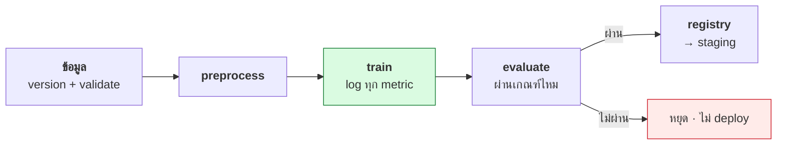

# บทที่ 72 · MLOps — ทำให้การทดลองซ้ำได้และตามรอยได้

> [บทที่ 66](66-training-and-finetuning.md) สอนเทรนโมเดล **บทนี้ตอบคำถามที่ตามมา: 3 เดือนต่อมา
> คุณจะรู้ได้อย่างไรว่าโมเดลตัวนี้เทรนมาจากอะไร และทำซ้ำให้เหมือนเดิมได้ไหม**
>
> ทุกตัวเลขวัดจริงด้วย [lab/repro_demo.py](../lab/repro_demo.py)

## 72.1 ปัญหาที่ทุกทีม ML เจอ {#s72-1}

```
"โมเดลใน production ตัวนี้เทรนจาก data ชุดไหน"        → ไม่มีใครจำได้
"ทำไม accuracy ตกจากเดือนที่แล้ว"                     → ไม่รู้เพราะไม่ได้บันทึก
"เทรนซ้ำให้เหมือนเดิมหน่อย"                          → ได้ผลไม่เหมือนเดิม
"ใครเปลี่ยน hyperparameter"                          → ไม่มี log
```

**ML ต่างจากซอฟต์แวร์ปกติตรงที่ผลลัพธ์ขึ้นกับ 3 อย่าง ไม่ใช่แค่โค้ด:**

```
โค้ด  +  ข้อมูล  +  hyperparameter  →  โมเดล
```

git version โค้ดได้ ([บทที่ 30](30-git.md)) **แต่ข้อมูลกับ hyperparameter ต้องมีระบบตามรอย
ต่างหาก** — นี่คือสิ่งที่ MLOps แก้

## 72.2 Reproducibility — จุดเริ่มของทุกอย่าง {#s72-2}

**ถ้าเทรนซ้ำแล้วได้ผลไม่เหมือนเดิม จะ debug อะไรก็ไม่ได้** เพราะแยกไม่ออกว่า
ผลต่างมาจากสิ่งที่แก้ หรือมาจากความสุ่ม

วัดจริง — เทรนโมเดลเดียวกัน:

```
=== ไม่ตั้ง seed — รัน 3 ครั้ง ===
  ครั้งที่ 1: loss = 0.191129
  ครั้งที่ 2: loss = 0.205169     ← ต่างทุกครั้ง
  ครั้งที่ 3: loss = 0.183538

=== ตั้ง seed=42 — รัน 3 ครั้ง ===
  ครั้งที่ 1: loss = 0.228443
  ครั้งที่ 2: loss = 0.228443     ← เหมือนเป๊ะ
  ครั้งที่ 3: loss = 0.228443
```

**ตั้ง seed แล้วผลซ้ำได้เป๊ะ** — นี่คือเงื่อนไขแรกก่อนจะทำอย่างอื่น

```python
import torch, random, numpy as np
torch.manual_seed(42); torch.cuda.manual_seed_all(42)
random.seed(42); np.random.seed(42)
torch.backends.cudnn.deterministic = True     # แลกความเร็วนิดหน่อยเพื่อความซ้ำได้
```

> ## ⚠️ seed อย่างเดียวไม่พอ — GPU มี op ที่ไม่ deterministic
>
> บาง CUDA op (เช่น atomic add) ให้ผลต่างกันเล็กน้อยแต่ละรอบแม้ตั้ง seed แล้ว
> ต้องเปิด `torch.use_deterministic_algorithms(True)` ด้วย **แลกกับความเร็ว
> ที่ลดลง** — เปิดตอนต้อง debug/reproduce ปิดตอนเทรนจริงที่เน้นเร็ว

## 72.3 สิ่งที่ต้องบันทึกเพื่อทำซ้ำได้จริง {#s72-3}

seed ซ้ำได้เฉพาะบน **environment เดียวกัน** — ต้องบันทึกทั้งชุด

วัดจริง (สิ่งที่ต้องเก็บ):

```
torch   : 2.8.0+cu128
python  : 3.12.3
cuda    : 12.8
platform: Linux-7.0.0-30-generic-x86_64
```

| ต้องบันทึก | เพราะ |
|---|---|
| **git commit ของโค้ด** | โค้ดเวอร์ชันไหน ([บทที่ 30](30-git.md)) |
| **hash/version ของ data** | data เปลี่ยน = ผลเปลี่ยน |
| hyperparameter ทั้งชุด | lr, batch, epochs, seed |
| **เวอร์ชัน library** | torch/cuda ต่างเวอร์ชัน = ผลต่าง ([บทที่ 65.7](65-linking-and-loading.md#s65-7)) |
| metric ที่วัดได้ | ไว้เทียบ |
| น้ำหนักโมเดลที่ได้ | ไฟล์ output |

> **ข้อ "version ของ data" คือที่คนลืมบ่อยที่สุด** — โค้ด git ได้ แต่ dataset
> ที่โตขึ้นเรื่อย ๆ หรือถูกแก้ ทำให้ผลเทรนต่างโดยไม่มีใครรู้ ควร version
> dataset ด้วย (DVC, git-lfs, หรืออย่างน้อยเก็บ hash)

## 72.4 Experiment tracking — เลิกจดใน Excel {#s72-4}

**ทุกการเทรนคือการทดลอง** — ต้องบันทึกว่าตั้งค่าอะไร ได้ผลอะไร ไม่งั้น
เทรน 50 รอบแล้วจำไม่ได้ว่ารอบไหนดีที่สุดเพราะอะไร

```python
# แนวคิด — เครื่องมือจริง (MLflow/W&B) ทำให้เอง
run = tracker.start_run()
run.log_params({"lr": 1e-4, "batch": 32, "seed": 42})
for epoch in range(epochs):
    run.log_metric("train_loss", loss, step=epoch)
    run.log_metric("val_acc", acc, step=epoch)
run.log_artifact("model.safetensors")       # เก็บผลลัพธ์
```

| เครื่องมือ | จุดเด่น | โฮสต์เอง |
|---|---|---|
| **MLflow** | ครบ · โอเพนซอร์ส · โฮสต์เองได้ | ✅ |
| **Weights & Biases** | UI ดีมาก · collaboration | ⚠️ cloud (มี self-host) |
| **TensorBoard** | เบา · มากับ PyTorch | ✅ |
| **DVC** | version data + pipeline | ✅ |

> **สำหรับคลัสเตอร์ในมหาวิทยาลัย MLflow โฮสต์เองคุ้มที่สุด** — ฟรี ข้อมูล
> อยู่กับเรา และต่อกับ Slurm ได้ (แต่ละ job log เข้า MLflow เดียวกัน)
> ไม่ต้องพึ่ง cloud ที่ต้องจ่ายและส่งข้อมูลออก

## 72.5 Model registry — โมเดลตัวไหนอยู่ production {#s72-5}

experiment tracking บันทึก "การทดลอง" · **registry จัดการ "โมเดลที่จะใช้จริง"**

```
เทรน 50 รอบ (experiment) → เลือกตัวดีสุด → ขึ้น registry
                                              ↓
                        staging → production → archived
```

| ต้องมีต่อโมเดลหนึ่งตัว | เพราะ |
|---|---|
| **version** | v1, v2, v3 — ย้อนกลับได้ |
| stage | staging / production / archived |
| ที่มา | ชี้กลับไปยัง experiment ที่เทรนมัน |
| **ผู้อนุมัติ** | ใครเป็นคนบอกว่าตัวนี้ขึ้น production ได้ |

> ## registry แก้ปัญหา "rollback โมเดล"
>
> เหมือน deploy โค้ดที่ย้อนกลับได้ ([บทที่ 55.7](55-ci-cd.md#s55-7)) — โมเดลใหม่ขึ้นแล้ว
> accuracy ตก ต้องย้อนกลับตัวเก่าได้ทันที **ถ้าไม่มี registry จะไม่รู้ด้วยซ้ำ
> ว่าตัวเก่าคือไฟล์ไหน**

## 72.6 Pipeline — ร้อยทุกขั้นให้ทำซ้ำได้ {#s72-6}



**หัวใจคือขั้น evaluate ที่มีเกณฑ์ผ่าน/ไม่ผ่านชัดเจน** — โมเดลใหม่ต้องดีกว่า
ตัวเดิมตามตัวเลขที่วัดได้ ถึงจะขึ้น ไม่ใช่ "รู้สึกว่าดีขึ้น"

เป็นหลักการเดียวกับ CI ([บทที่ 55](55-ci-cd.md)) — **automate แล้วมีเกณฑ์ที่เครื่องตรวจได้**
ต่างกันแค่ CI ตรวจโค้ด ส่วนนี้ตรวจโมเดล

## 72.7 Model drift — โมเดลที่ค่อย ๆ แย่ลงเอง {#s72-7}

ต่างจากโค้ดที่ deploy แล้วทำงานเหมือนเดิมตลอด **โมเดลแย่ลงตามเวลาแม้ไม่มีใครแตะ**

```
โลกจริงเปลี่ยน → ข้อมูลที่เข้ามาต่างจากตอนเทรน → โมเดลทำนายแย่ลง
(เช่น พฤติกรรมผู้ใช้เปลี่ยน, เทรนด์ใหม่, ราคาเปลี่ยน)
```

| ชนิด | คือ |
|---|---|
| **Data drift** | ข้อมูลขาเข้าเปลี่ยนการกระจาย |
| **Concept drift** | ความสัมพันธ์ input→output เปลี่ยน |

**ต้องเฝ้าเหมือน observability ([บทที่ 68](68-observability-deep.md)) แต่เฝ้าคุณภาพโมเดล:**

- เฝ้าการกระจายของ input เทียบกับตอนเทรน
- เฝ้า metric จริง (ถ้ารู้ผลจริงทีหลัง เช่นผู้ใช้คลิกไหม)
- ตั้ง alert เมื่อ accuracy ตกต่ำกว่าเกณฑ์ → เทรนใหม่

## 72.8 เริ่มยังไงโดยไม่ over-engineer {#s72-8}

```
1. seed + บันทึก environment      ← เริ่มที่นี่ · reproducibility ก่อน
2. log params + metrics ทุก run   ← MLflow/TensorBoard
3. version dataset                ← DVC หรืออย่างน้อย hash
4. model registry                 ← เมื่อมีโมเดลขึ้น production จริง
5. drift monitoring + auto-retrain ← เมื่อ scale
```

> **อย่าเพิ่งลง MLOps platform เต็มระบบตั้งแต่วันแรก** — เริ่มจาก seed +
> log ลงไฟล์ก็ตอบโจทย์ reproducibility ได้แล้ว เพิ่มเครื่องมือเมื่อจำนวน
> experiment เริ่มจำไม่ไหวจริง ๆ (หลักการเดียวกับ observability [บทที่ 68.9](68-observability-deep.md#s68-9))

## แบบฝึกหัด

1. `python3 lab/repro_demo.py` — ไม่ตั้ง seed ผลต่างกันแค่ไหน ตั้งแล้วเหมือนไหม
2. เปิด `torch.use_deterministic_algorithms(True)` แล้ววัดว่าเทรนช้าลงไหม
3. เขียนฟังก์ชันที่ log params + metrics ลงไฟล์ JSON ต่อ run
4. หา dataset ที่คุณใช้ แล้วคำนวณ hash ของมัน — ถ้ามันเปลี่ยน คุณจะรู้ไหม
5. ออกแบบเกณฑ์ผ่าน/ไม่ผ่านสำหรับโมเดลของคุณ ([72.6](#s72-6)) — วัดด้วยตัวเลขอะไร
6. ตอบตัวเอง: โมเดลล่าสุดที่คุณเทรน ถ้าต้องเทรนซ้ำให้เหมือนเดิม ทำได้ไหม
   ขาดข้อมูลอะไร ([72.3](#s72-3))
7. ตั้ง MLflow บนคลัสเตอร์ (หรือเครื่องคุณ) แล้ว log การเทรนหนึ่งครั้งเข้าไป

***
[⬅ เทรนและ fine-tune ให้เป็น](66-training-and-finetuning.md) · [สารบัญ](../README.md) · [แบ่ง GPU ให้หลายคนใช้ ➡](49-gpu-on-containers-and-k8s.md)
