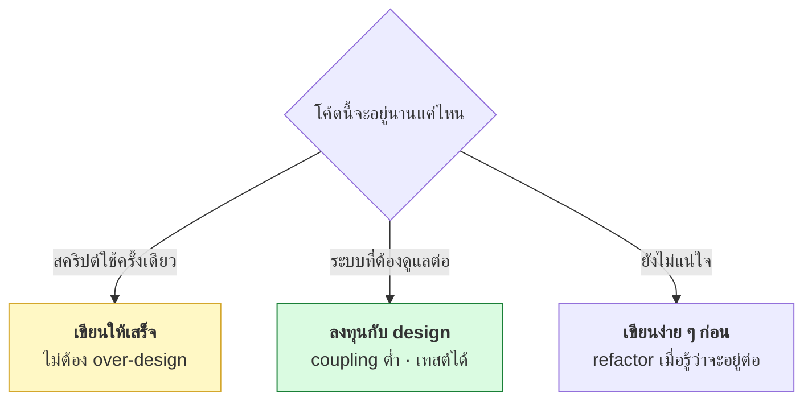

# บทที่ 73 · หลักการออกแบบโค้ด — เขียนให้แก้ง่าย ไม่ใช่แค่ให้ทำงาน

> ทั้งเล่มนี้เขียนโค้ดที่**ทำงานได้** บทนี้ถามคำถามที่ยากกว่า:
> **6 เดือนต่อมาเมื่อต้องแก้ โค้ดนี้จะแก้ง่ายหรือแตะแล้วพัง**
>
> โค้ดถูกอ่านบ่อยกว่าถูกเขียนหลายสิบเท่า — เขียนให้คน (รวมทั้งตัวคุณในอนาคต) อ่านออก

## 73.1 Coupling และ Cohesion — สองคำที่วัดคุณภาพโค้ด {#s73-1}

```
Coupling  = โมดูลผูกกันแน่นแค่ไหน   → ต้องการ "ต่ำ"
Cohesion  = ในโมดูลเกี่ยวข้องกันไหม → ต้องการ "สูง"
```

| | ต่ำ (ดี) | สูง (แย่) |
|---|---|---|
| **Coupling** | แก้ที่หนึ่งไม่กระทบที่อื่น | แก้นิดเดียวพังทั้งระบบ |

| | สูง (ดี) | ต่ำ (แย่) |
|---|---|---|
| **Cohesion** | ฟังก์ชันในไฟล์เดียวทำเรื่องเดียวกัน | ไฟล์เดียวทำสิบเรื่องไม่เกี่ยวกัน |

> **เป้าหมายเดียว: low coupling, high cohesion** — โค้ดที่แต่ละส่วนทำเรื่องของ
> ตัวเองชัดเจน และแก้ส่วนหนึ่งไม่ลาม นี่คือแก่นของทุกหลักการที่เหลือในบท

## 73.2 พิสูจน์ว่า coupling ทำร้ายยังไง — ด้วยการเทสต์ {#s73-2}

**coupling ที่แน่นเกินวัดได้ตรง ๆ: โค้ดที่ผูกแน่นจะเทสต์ไม่ได้**

```python
# ❌ ผูกแน่น — เรียก service ภายนอกตรง ๆ ในตัวเอง
class OrderBad:
    def total_with_tax(self, price):
        rate = external_tax_api()        # ← ควบคุมไม่ได้ตอนเทสต์
        return price * (1 + rate)
```

รันจริง — ผลแกว่งเพราะพึ่งของที่คุมไม่ได้:

```
total_with_tax(100) = 110.00
total_with_tax(100) = 107.00     ← เทสต์เขียน assert ไม่ได้เลย
total_with_tax(100) = 107.00
```

**ฉีด dependency เข้ามาแทน (Dependency Injection):**

```python
# ✅ ส่ง dependency เข้ามา — คุมได้ตอนเทสต์
class OrderGood:
    def __init__(self, tax_provider):
        self.tax = tax_provider
    def total_with_tax(self, price):
        return price * (1 + self.tax.rate())

class FakeTax:                    # ใช้ตอนเทสต์
    def rate(self): return 0.07
```

```
OrderGood(FakeTax()).total_with_tax(100) = 107.00
  ✅ assert 107.0 ผ่าน — เพราะควบคุม dependency ได้
```

> ## "เทสต์ยาก" คือสัญญาณของ design ที่แย่
>
> ถ้าเขียนเทสต์ให้โค้ดยาก **ไม่ใช่ปัญหาของการเทสต์ แต่เป็นปัญหาของ design** —
> โค้ดที่ผูกแน่นกับฐานข้อมูล/เน็ต/เวลา/สุ่ม เทสต์ไม่ได้
>
> นี่คือเหตุผลที่[บทที่ 32](32-testing-with-pytest.md) เรื่องเทสต์กับบทนี้เชื่อมกัน —
> **การเขียนเทสต์บังคับให้ design ดีขึ้นโดยอัตโนมัติ**

## 73.3 SOLID — 5 หลักที่ได้ยินบ่อยที่สุด {#s73-3}

| | ย่อจาก | ใจความ |
|---|---|---|
| **S** | Single Responsibility | หนึ่งคลาส/ฟังก์ชัน รับผิดชอบเรื่องเดียว |
| **O** | Open/Closed | เพิ่มของใหม่ได้โดยไม่แก้ของเดิม |
| **L** | Liskov Substitution | subclass ใช้แทน parent ได้โดยไม่พัง |
| **I** | Interface Segregation | interface เล็ก ๆ เฉพาะทาง ดีกว่าอันใหญ่ |
| **D** | Dependency Inversion | พึ่ง abstraction ไม่ใช่ตัวจริง ([73.2](#s73-2)) |

**S กับ D คือสองตัวที่ใช้บ่อยที่สุดและได้ผลจริงที่สุด** — ที่เหลือรู้ไว้พอ

### S — Single Responsibility ที่เห็นบ่อย

```python
# ❌ ทำหลายเรื่องในคลาสเดียว
class User:
    def save_to_db(self): ...      # เรื่องฐานข้อมูล
    def send_email(self): ...      # เรื่องอีเมล
    def render_html(self): ...     # เรื่องแสดงผล

# ✅ แยกตามความรับผิดชอบ
class User: ...                    # แค่ข้อมูล
class UserRepository: ...          # ฐานข้อมูล
class EmailService: ...            # อีเมล
```

> **สัญญาณว่าละเมิด S: คำว่า "และ" ในคำอธิบายคลาส** — "คลาสนี้เก็บ user
> **และ** ส่งอีเมล **และ** render" = ควรแยกเป็นสาม

## 73.4 อย่า over-engineer — YAGNI และ KISS {#s73-4}

หลักการข้างบนดีมาก **แต่ใช้เกินก็เป็นโทษ**

| หลัก | ย่อจาก | ใจความ |
|---|---|---|
| **YAGNI** | You Aren't Gonna Need It | อย่าเขียนเผื่ออนาคตที่ยังไม่มาถึง |
| **KISS** | Keep It Simple | ทางที่ง่ายที่สุดที่ใช้ได้ ดีกว่าฉลาดแต่ซับซ้อน |
| **DRY** | Don't Repeat Yourself | อย่าเขียนโค้ดเดิมซ้ำ — แต่ **อย่าฝืนรวมของที่แค่คล้ายกัน** |

> ## กับดัก: abstraction ที่มาเร็วเกินไป
>
> คนที่เพิ่งเรียน SOLID มักสร้าง interface, factory, layer เต็มไปหมดตั้งแต่
> โปรแกรมยังเล็ก — **ซับซ้อนโดยไม่ได้แก้ปัญหาอะไร**
>
> **เขียนแบบตรงไปตรงมาก่อน แล้ว refactor เมื่อเห็น pattern จริง** — abstraction
> ที่ดีมาจากการเห็นโค้ดซ้ำ 3 ครั้ง ไม่ใช่การเดาล่วงหน้า
>
> DRY ที่ผิดที่ร้ายกว่าโค้ดซ้ำ — รวมสองอย่างที่**บังเอิญเหมือน**แต่จะเปลี่ยน
> คนละทิศ ทำให้แก้ยากกว่าเดิม

## 73.5 Design pattern ที่เจอจริงในเล่มนี้ {#s73-5}

pattern คือ "ทางแก้ที่ใช้ซ้ำได้กับปัญหาที่เจอบ่อย" — และหนังสือเล่มนี้ใช้ไป
หลายอันแล้วโดยไม่ได้เรียกชื่อ

| Pattern | ทำอะไร | เจอที่ไหนในเล่ม |
|---|---|---|
| **Strategy** | สลับอัลกอริทึมได้ | เลือก LB algorithm ([บทที่ 57.5](57-scaling-out.md#s57-5)) |
| **Observer** | แจ้งเมื่อมีเหตุ | SSE/pub-sub ([บทที่ 69](69-websocket-sse-deep.md)) |
| **Factory** | สร้าง object โดยซ่อนรายละเอียด | สร้าง connection |
| **Adapter** | ห่อของเก่าให้ interface ใหม่ | FFI wrapper ([บทที่ 64](64-ffi-and-bindings.md)) |
| **Decorator** | เพิ่มพฤติกรรมโดยไม่แก้ของเดิม | `@lru_cache` ([บทที่ 67](67-profiling.md)) · `@app.post` |
| **Singleton** | มี instance เดียว | connection pool ([บทที่ 27](27-database-and-performance.md)) |

> **`@lru_cache` ที่ใช้เร่ง fib ใน[บทที่ 67](67-profiling.md) คือ Decorator pattern** — เพิ่ม
> พฤติกรรม (จำผลลัพธ์) โดยไม่แตะโค้ดเดิม คุณใช้ pattern อยู่แล้วทุกวัน
> แค่ไม่ได้เรียกชื่อ

**อย่าท่อง pattern แล้วยัดใส่ทุกที่** — รู้จักไว้เพื่อ**สื่อสาร** (บอกเพื่อนว่า
"ใช้ strategy ตรงนี้" เข้าใจตรงกันเร็ว) และเพื่อ**จำทางแก้ที่พิสูจน์แล้ว**

## 73.6 โค้ดที่คนอ่านออก {#s73-6}

design ดีเริ่มจากสิ่งเล็ก ๆ ที่ทำทุกวัน

| ทำ | แทน |
|---|---|
| ตั้งชื่อที่บอกว่าทำอะไร | `calculate_tax()` ไม่ใช่ `calc()` หรือ `x()` |
| ฟังก์ชันสั้น ทำเรื่องเดียว | ไม่ใช่ฟังก์ชัน 200 บรรทัด |
| comment บอก **ทำไม** ไม่ใช่ **อะไร** | โค้ดบอก "อะไร" อยู่แล้ว |
| early return ลดการซ้อน | ไม่ใช่ if ซ้อน 5 ชั้น |
| ค่าคงที่มีชื่อ | `MAX_RETRY = 5` ไม่ใช่เลข 5 ลอย ๆ |

> **comment ที่ดีบอกเหตุผล ไม่ใช่แปลโค้ด** — CLAUDE.md ของโปรเจกต์นี้ก็เป็น
> ตัวอย่าง: มันไม่ได้อธิบายว่าโค้ดทำอะไร แต่บอกว่า**ทำไมถึงทำแบบนั้น**
> (เจอกับดักอะไรมา) ซึ่งเป็นข้อมูลที่โค้ดบอกเองไม่ได้

## 73.7 เมื่อไรควรลงทุนกับ design {#s73-7}



**ไม่ใช่ทุกโค้ดต้อง design สวย** — สคริปต์วิเคราะห์ข้อมูลครั้งเดียวเขียนให้เสร็จ
ก็พอ ส่วนระบบที่ทีมต้องดูแลไปอีกหลายปี การลงทุนกับ design คุ้มมาก

นี่คือการประเมิน trade-off แบบเดียวกับ technical debt ([บทที่ 60.2](60-grc-and-compliance.md#s60-2)) —
**"ยอมรับหนี้" เป็นการตัดสินใจที่ถูกได้ ถ้ารู้ตัวว่ากำลังก่อหนี้**

## แบบฝึกหัด

1. รันตัวอย่าง coupling ([73.2](#s73-2)) — OrderBad เทสต์ไม่ได้เพราะอะไร
2. หาคลาสในโค้ดคุณที่มีคำว่า "และ" ในหน้าที่ ([73.3](#s73-3)) — แยกได้ไหม
3. หา `@decorator` ที่คุณใช้อยู่ — มันเพิ่มพฤติกรรมอะไรโดยไม่แก้ของเดิม
4. หาตัวเลข/สตริงลอย ๆ (magic value) ในโค้ดคุณ แล้วตั้งชื่อให้มัน
5. ตอบตัวเอง: โค้ดที่คุณเขียนล่าสุด ถ้าต้องเทสต์ ยากไหม — ถ้ายาก coupling
   อยู่ตรงไหน ([73.2](#s73-2))
6. หาที่ที่คุณ over-engineer (สร้าง abstraction ที่ไม่ได้ใช้จริง) แล้วลบทิ้ง
7. เขียน comment ที่บอก "ทำไม" ไม่ใช่ "อะไร" ให้โค้ดที่งงที่สุดของคุณ

***
[⬅ การระบุตัวตนบนอินเทอร์เน็ต](62-anonymity-and-tunneling.md) · [สารบัญ](../README.md) · [สถาปัตยกรรมซอฟต์แวร์ ➡](74-software-architecture.md)
