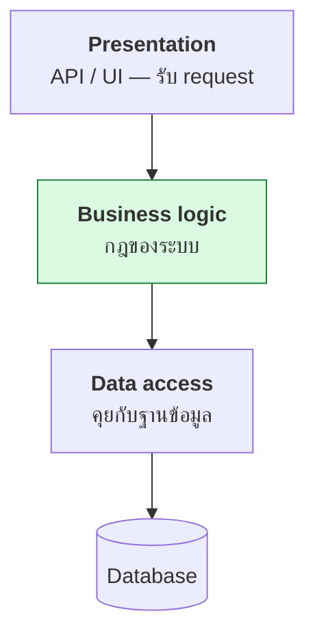
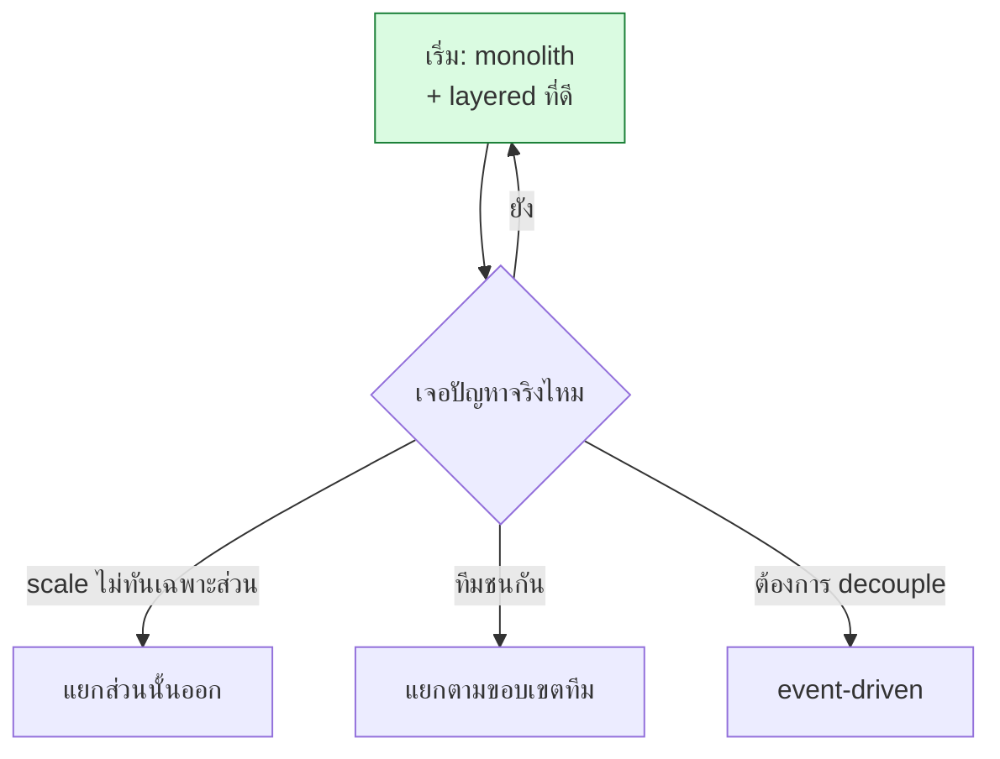

# บทที่ 74 · สถาปัตยกรรมซอฟต์แวร์ — จัดโครงสร้างระบบทั้งก้อน

> [บทที่ 73](73-design-principles.md) จัดระเบียบโค้ดในไฟล์ **บทนี้ขยับขึ้นไปอีกชั้น: จัดระเบียบ
> ระบบทั้งก้อน** — แบ่งเป็นส่วนอย่างไร ส่วนไหนคุยกับส่วนไหน แยกเมื่อไร
>
> การตัดสินใจตรงนี้แก้ทีหลังแพงที่สุด — เลือกให้เหมาะกับขนาดจริง ไม่ใช่ขนาดในฝัน

## 74.1 Monolith กับ Microservices — สงครามที่คนเข้าใจผิด {#s74-1}

```
Monolith     : ทุกอย่างอยู่ใน process เดียว deploy ก้อนเดียว
Microservices: แยกเป็นหลายบริการเล็ก ๆ deploy แยกกัน
```

| | Monolith | Microservices |
|---|---|---|
| เริ่มต้น | ✅ **ง่ายกว่ามาก** | ซับซ้อนตั้งแต่วันแรก |
| deploy | ก้อนเดียว | หลายก้อน ต้องมี orchestration |
| แก้บั๊กข้ามส่วน | ง่าย (อยู่ที่เดียว) | ยาก (ข้าม network) |
| scale เฉพาะส่วน | ❌ ต้อง scale ทั้งก้อน | ✅ scale เฉพาะที่ร้อน |
| ทีมใหญ่แยกกันทำ | ชนกัน | ✅ แยกกันได้ |
| debug ([บทที่ 68](68-observability-deep.md)) | ง่าย | ต้องมี distributed tracing |

> ## เริ่มด้วย monolith เกือบทุกครั้ง
>
> **microservices แก้ปัญหาของทีมใหญ่และระบบใหญ่** — ถ้าคุณยังไม่มีปัญหานั้น
> มันเพิ่มแต่ความซับซ้อน: network call ที่เคยเป็น function call, transaction
> ที่ข้ามบริการ ([บทที่ 71](71-transactions-and-isolation.md)), การ deploy ที่ต้องประสานกัน
>
> **"เริ่มด้วย monolith ที่ออกแบบดี แล้วค่อยแยกส่วนที่จำเป็นออกมา"** คือคำแนะนำ
> ที่ปลอดภัยที่สุด — บริษัทใหญ่หลายเจ้าที่ขึ้นชื่อเรื่อง microservices ก็เริ่มจาก
> monolith แล้วค่อยแยกตอนโต

**สัญญาณว่าถึงเวลาแยกบางส่วนออก:**

- ส่วนหนึ่งต้อง scale ต่างจากส่วนอื่นมาก (เช่น GPU inference vs web)
- ทีมชนกันเพราะแก้ไฟล์เดียวกันตลอด
- ส่วนหนึ่งพังแล้วลากทั้งระบบล่ม

## 74.2 Layered architecture — โครงพื้นฐานที่สุด {#s74-2}



**กฎเหล็ก: ชั้นบนเรียกชั้นล่างได้ ชั้นล่างห้ามเรียกชั้นบน** — ทำให้แต่ละชั้น
เปลี่ยนได้โดยไม่กระทบชั้นอื่น (เปลี่ยนฐานข้อมูลไม่กระทบ business logic)

| ชั้น | รับผิดชอบ | เจอในเล่ม |
|---|---|---|
| Presentation | รับ/ตอบ request | ([บทที่ 12](12-api-design-practices.md)) |
| Business logic | กฎจริงของระบบ | หัวใจของแอป |
| Data access | อ่าน/เขียนข้อมูล | ([บทที่ 27](27-database-and-performance.md), [71](71-transactions-and-isolation.md)) |

> **ข้อผิดพลาดที่พบบ่อย: ยัด business logic ลงใน SQL หรือใน controller** —
> ทำให้ทดสอบยากและย้ายยาก business logic ควรอยู่ชั้นกลางที่ไม่รู้จักทั้ง
> HTTP และ SQL ([บทที่ 73.2](73-design-principles.md#s73-2) เรื่องแยก dependency)

## 74.3 Hexagonal — แยกแกนออกจากโลกภายนอก {#s74-3}

ต่อยอดจาก layered — **แกน business logic อยู่ตรงกลาง ไม่รู้จักโลกภายนอกเลย**

```
        HTTP ──┐                  ┌── PostgreSQL
        CLI  ──┼─→ [ แกน logic ] ─┼── Redis
        gRPC ──┘   (ไม่รู้จักใคร)  └── external API
              adapter            adapter
```

**แกนไม่รู้ว่าถูกเรียกจาก HTTP หรือ CLI และไม่รู้ว่าเก็บใน Postgres หรือ
Redis** — สลับได้หมดโดยไม่แตะ logic

> ## ทำไมสถาปัตยกรรมนี้ทำให้เทสต์ง่าย
>
> แกนที่ไม่พึ่งของภายนอก **เทสต์ได้โดยไม่ต้องมีฐานข้อมูลหรือเน็ต** — เสียบ
> fake adapter เข้าไปแทน ([บทที่ 73.2](73-design-principles.md#s73-2) Dependency Injection ในระดับสถาปัตยกรรม)
>
> เป็นเหตุผลเดียวกับที่ทำให้ port ระบบไป cloud หรือเปลี่ยนฐานข้อมูลได้ง่าย —
> โลกภายนอกเป็นแค่ปลั๊กที่ถอดเปลี่ยนได้

## 74.4 Event-driven — คุยกันผ่านเหตุการณ์ {#s74-4}

แทนที่บริการ A จะเรียก B ตรง ๆ **A ประกาศ "เหตุการณ์" แล้วใครสนใจก็ฟังเอง**

```
❌ ตรง ๆ  : Order → เรียก Email → เรียก Inventory → เรียก Analytics
              (Order ต้องรู้จักทุกคน · คนหนึ่งล่ม Order รอ)

✅ event  : Order ประกาศ "order.created" → Email/Inventory/Analytics ฟังเอง
              (Order ไม่ต้องรู้ว่าใครฟัง · เพิ่มผู้ฟังได้โดยไม่แก้ Order)
```

**นี่คือ Observer pattern ([บทที่ 73.5](73-design-principles.md#s73-5)) ในระดับสถาปัตยกรรม** — และเป็น
โครงเดียวกับคิวงาน ([บทที่ 56](56-background-jobs-and-queues.md)) และ pub/sub ([บทที่ 57.6](57-scaling-out.md#s57-6))

| ได้ | เสีย |
|---|---|
| ✅ เพิ่มผู้ฟังใหม่โดยไม่แก้ผู้ส่ง | 🔴 ตามรอยยาก — ต้องมี tracing ([บทที่ 68](68-observability-deep.md)) |
| ✅ ผู้ส่งไม่รอผู้ฟัง | flow กระจาย เข้าใจภาพรวมยาก |
| ✅ ทนต่อการที่ผู้ฟังล่มชั่วคราว | ต้องคิดเรื่อง at-least-once ([บทที่ 56.3](56-background-jobs-and-queues.md#s56-3)) |

## 74.5 ที่เก็บข้อมูล — SQL หรือ NoSQL {#s74-5}

การเลือกฐานข้อมูลคือการตัดสินใจสถาปัตยกรรมที่แก้ทีหลังแพงมาก

| | SQL (Postgres, MySQL) | NoSQL |
|---|---|---|
| โครงสร้าง | schema ตายตัว | ยืดหยุ่น |
| **transaction/ACID** | ✅ แข็งแรง ([บทที่ 71](71-transactions-and-isolation.md)) | ⚠️ แล้วแต่เจ้า |
| ความสัมพันธ์ (join) | ✅ เก่ง | ❌ ไม่ถนัด |
| scale แนวนอน | ยากกว่า | ✅ ออกแบบมาเพื่อสิ่งนี้ |
| เหมาะกับ | ข้อมูลมีความสัมพันธ์ · เงิน | เอกสาร · cache · time-series |

> **เริ่มด้วย SQL เกือบทุกครั้ง** — มันจัดการข้อมูลส่วนใหญ่ได้ดีและมี ACID
> ให้ฟรี ย้ายไป NoSQL เมื่อมีเหตุผลชัดเจน (สเกลมหาศาล, ข้อมูลไม่มีโครงสร้าง)
> ไม่ใช่เพราะมันฟังดูทันสมัย — เป็น YAGNI ([บทที่ 73.4](73-design-principles.md#s73-4)) ในระดับฐานข้อมูล
>
> และ **ระบบจริงส่วนใหญ่ใช้ทั้งคู่** — SQL เป็นหลัก + Redis cache + object
> storage สำหรับไฟล์ ([บทที่ 57.3](57-scaling-out.md#s57-3))

## 74.6 กฎของ Conway — สถาปัตยกรรมสะท้อนทีม {#s74-6}

> **"ระบบที่องค์กรออกแบบ จะมีโครงสร้างเลียนแบบโครงสร้างการสื่อสารขององค์กรนั้น"**

```
ทีมเดียว 3 คน        →  มักได้ monolith (และควรเป็น)
4 ทีมแยกกัน          →  มักได้ 4 บริการ (ตามขอบเขตทีม)
```

**นี่ไม่ใช่ทฤษฎีลอย ๆ** — ถ้าโครงสร้างทีมกับสถาปัตยกรรมไม่เข้ากัน จะเจ็บ เช่น
บังคับทีมเดียวดูแล 10 microservices (เหนื่อยเกิน) หรือให้ 5 ทีมแก้ monolith
เดียว (ชนกันตลอด)

> **สำหรับห้องแล็บ/ทีมเล็กในมหาวิทยาลัย: monolith + โครงสร้างชั้นที่ดี คือคำตอบ**
> ([บทที่ 74.2](#s74-2)) — microservices ต้องการคนดูแล infrastructure ที่ทีมเล็กไม่มี
> (เหตุผลเดียวกับที่[บทที่ 49](49-gpu-on-containers-and-k8s.md) บอกว่า k8s ต้องมีคนดูแล)

## 74.7 ตัดสินใจสถาปัตยกรรมยังไง {#s74-7}



**หลักการเดียวที่คุมทุกอย่าง: อย่าแก้ปัญหาที่ยังไม่มี** — สถาปัตยกรรมที่ซับซ้อน
เกินขนาดจริงคือหนี้ที่จ่ายทุกวัน เริ่มง่าย แล้วเพิ่มความซับซ้อนเมื่อมีปัญหา
จริงมาบังคับ ([บทที่ 73.4](73-design-principles.md#s73-4) YAGNI · [บทที่ 57.1](57-scaling-out.md#s57-1) เพิ่มเครื่องเป็นทางเลือกท้าย ๆ)

## แบบฝึกหัด

1. วาดสถาปัตยกรรมของระบบที่คุณทำอยู่ — เป็น monolith หรือ microservices
   เหมาะกับขนาดทีมไหม ([74.6](#s74-6))
2. หา business logic ในโค้ดคุณที่ปนอยู่ใน controller หรือ SQL ([74.2](#s74-2))
   — ย้ายออกมาชั้นกลางได้ไหม
3. ตอบตัวเอง: ถ้าต้องเปลี่ยนจาก Postgres เป็นอื่น ต้องแก้กี่ที่ ([74.3](#s74-3))
4. หาจุดที่บริการเรียกกันตรง ๆ ที่ควรเป็น event แทน ([74.4](#s74-4))
5. ระบบคุณใช้ SQL หรือ NoSQL — เลือกเพราะเหตุผลจริงหรือเพราะกระแส ([74.5](#s74-5))
6. ตอบตัวเอง: ตอนนี้คุณมีความซับซ้อนทางสถาปัตยกรรมที่ยังไม่มีปัญหามารองรับไหม
   ([74.7](#s74-7))
7. ออกแบบ: ถ้าคลัสเตอร์ GPU ของคุณต้องเปิดเป็นบริการให้ทั้งคณะ จะแยก
   inference ออกจากส่วนอื่นไหม เพราะอะไร ([74.1](#s74-1))

***
[⬅ หลักการออกแบบโค้ด](73-design-principles.md) · [สารบัญ](../README.md) · [ทฤษฎีการคำนวณภาคปฏิบัติ ➡](75-computation-theory.md)
