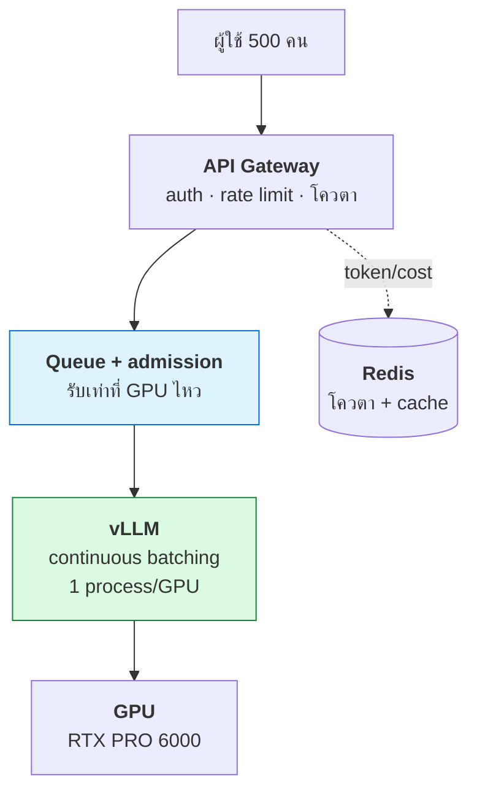

# บทที่ 77 · ออกแบบระบบจากศูนย์ — รวมทุกบทเข้าด้วยกัน

> บทนี้ไม่มีเนื้อหาใหม่ **มันคือการเอาทุกบทมาประกอบเป็นระบบจริง** — โจทย์
> "ออกแบบ LLM serving API ให้ทั้งคณะใช้" ซึ่งรวม GPU, scaling, queue, cache,
> security, observability เข้าด้วยกัน
>
> วิธีคิดในบทนี้ใช้ได้กับการออกแบบระบบอะไรก็ได้ — และคือสิ่งที่ถามใน
> "system design interview"

## 77.1 กรอบการคิด — อย่าเพิ่งวาดกล่อง {#s77-1}

**คนส่วนใหญ่รีบวาด architecture ทันที — ผิด** เริ่มจากคำถามก่อน

```
1. Requirement   — ระบบต้องทำอะไร · ไม่ทำอะไร
2. Scale         — กี่ผู้ใช้ · กี่ request/วิ · ข้อมูลใหญ่แค่ไหน
3. ข้อจำกัด      — งบ · ฮาร์ดแวร์ · คนดูแล
4. ค่อยออกแบบ    — แล้วจึงวาดกล่อง
```

> **การถาม requirement คือครึ่งหนึ่งของ system design** — ระบบสำหรับ 10 คน
> กับ 10,000 คน ออกแบบคนละแบบสิ้นเชิง ถ้าไม่รู้ scale ก็ออกแบบไม่ได้

## 77.2 โจทย์ — LLM API ให้ทั้งคณะใช้ {#s77-2}

**Requirement:**

| ข้อ | ค่า |
|---|---|
| ผู้ใช้ | นักศึกษา/อาจารย์ ~500 คน |
| ใช้พร้อมกันจริง (peak) | ~30-50 คน |
| โมเดล | Llama-3 8B / Qwen 7B |
| ฮาร์ดแวร์ | RTX PRO 6000 (96 GB) 1-2 ใบ |
| ต้องมี | โควตาต่อคน · ไม่ให้คนเดียวยึดหมด |

**ขั้นแรกเสมอ: คำนวณความจุก่อน** ([บทที่ 47](47-gpu-memory-and-kv-cache.md))

```
96 GB − น้ำหนัก 16 GB − context overhead ≈ 78 GB ให้ KV cache
รับพร้อมกันได้ ~40-160 คน (ขึ้นกับ context length) — ดู vram_calc.py
```

**ผลลัพธ์: การ์ดใบเดียวรับ 30-50 คนได้สบาย** — นี่เปลี่ยนทุกอย่าง เพราะแปลว่า
**ไม่ต้อง scale out** ([บทที่ 57.1](57-scaling-out.md#s57-1))

## 77.3 ออกแบบทีละชั้น {#s77-3}



| ชั้น | ทำอะไร | บทที่เกี่ยวข้อง |
|---|---|---|
| **Gateway** | auth · นับ token ต่อคน · rate limit | [9](09-authentication.md), [12](12-api-design-practices.md), [57.6](57-scaling-out.md#s57-6) |
| **Queue** | รับเท่าที่ GPU ไหว เกินให้รอ/429 | [56](56-background-jobs-and-queues.md), [57.7](57-scaling-out.md#s57-7) |
| **vLLM** | continuous batching · 1 process/GPU | [48](48-serving-llm.md), [57.7](57-scaling-out.md#s57-7) |
| **Redis** | โควตา token สะสม · cache ผลซ้ำ | [52.6](52-ai-system-security.md#s52-6), [57.6](57-scaling-out.md#s57-6) |

**การตัดสินใจสำคัญที่คนพลาด:**

- **1 process ต่อ GPU ไม่ใช่หลาย process** — vLLM ทำ batching ให้เอง ([บทที่ 57.7](57-scaling-out.md#s57-7))
- **rate limit นับ token ไม่ใช่นับ request** — request เดียว context ยาวกินทรัพยากรเป็นพันเท่า ([บทที่ 52.6](52-ai-system-security.md#s52-6))
- **backpressure ไม่ใช่รับทุกคน** — เกินความจุให้ 429 + Retry-After ([บทที่ 57.7](57-scaling-out.md#s57-7))

## 77.4 ไล่ตามเส้นทาง request เดียว {#s77-4}

การออกแบบที่ดีต้องเดินตาม request ได้ว่าผ่านอะไรบ้าง

```
1. ผู้ใช้ส่ง prompt + token ยืนยันตัวตน     → auth (บทที่ 9)
2. Gateway เช็คโควตา token เดือนนี้           → Redis (บทที่ 52.6)
   เกินโควตา → 429 จบ
3. เช็ค cache: prompt นี้เคยถามไหม            → Redis (บทที่ 57.6)
   เจอ → คืนเลย ไม่ยิง GPU
4. เข้า queue                                → ถ้าเต็ม 429 + Retry-After
5. vLLM รับเข้า batch ปัจจุบัน               → continuous batching
6. stream token กลับด้วย SSE                 → บทที่ 69
7. บันทึก token ที่ใช้เข้าโควตา              → Redis
```

> **การเดินตาม request แบบนี้เผยจุดอ่อน** — เช่น "ขั้นที่ 3 cache แต่ถ้า prompt
> มี timestamp จะไม่เคย hit เลย" หรือ "ขั้นที่ 6 ถ้า user ปิด browser กลางคัน
> GPU ยังทำงานต่อไหม" คำถามเหล่านี้โผล่ตอนเดินตามเส้นทาง ไม่ใช่ตอนวาดกล่อง

## 77.5 คิดถึงตอนพัง — ไม่ใช่แค่ตอนปกติ {#s77-5}

**ระบบที่ออกแบบดีตอบได้ว่า "ถ้า X พังจะเป็นยังไง"**

| ถ้า...พัง | เกิดอะไร | ป้องกัน |
|---|---|---|
| GPU OOM | request นั้นตาย · ตัวอื่นรอด? | ตั้ง `max_num_seqs` ให้พอดี ([บทที่ 66.1](66-training-and-finetuning.md#s66-1)) |
| Redis ล่ม | โควตา/cache หาย | 🔴 SPOF — cache miss ยอมได้ แต่โควตาต้องมี fallback ([บทที่ 57.6](57-scaling-out.md#s57-6)) |
| คนเดียวยิงถล่ม | คนอื่นอดใช้ | rate limit + โควตา ([บทที่ 52.6](52-ai-system-security.md#s52-6)) |
| การ์ดร้อน throttle | ช้าลงทั้งระบบ | เฝ้า temp/power ([บทที่ 51](51-gpu-observability-and-cost.md)) |
| deploy โมเดลใหม่ | request กลางคันตาย | graceful shutdown ([บทที่ 57.5](57-scaling-out.md#s57-5)) |

## 77.6 เฝ้าอะไร {#s77-6}

ระบบที่ deploy แล้วต้องรู้ว่ามันเป็นยังไง ([บทที่ 51](51-gpu-observability-and-cost.md), [68](68-observability-deep.md))

| ตัวชี้ | บอกอะไร |
|---|---|
| **TTFT / TPOT** | ผู้ใช้รู้สึกเร็วไหม ([บทที่ 48](48-serving-llm.md)) |
| **Goodput** | request ที่ยังทันเวลา (ไม่ใช่ throughput เปล่า) |
| queue depth | รับไม่ทันไหม ([บทที่ 56.7](56-background-jobs-and-queues.md#s56-7)) |
| token ต่อคน | ใครใช้เยอะ · ควรปรับโควตาไหม |
| GPU power/util | ใช้การ์ดคุ้มไหม ([บทที่ 51.1](51-gpu-observability-and-cost.md#s51-1)) |

## 77.7 เมื่อไรถึงต้อง scale ออก {#s77-7}

**เริ่มด้วยการ์ดใบเดียวเสมอ** ([บทที่ 57.1](57-scaling-out.md#s57-1)) — เพิ่มเมื่อมีสัญญาณจริง

```
queue depth โตไม่ลด · TTFT เกินที่รับได้ · การ์ดเต็มตลอด
   → เพิ่มการ์ดใบที่สอง + load balancer (least pending, ไม่ใช่ round-robin)
```

> **round-robin แย่กับ LLM** — request ยาว 4000 token กับ 10 token นับเท่ากันไม่ได้
> ต้องใช้ least-pending-tokens ([บทที่ 57.5](57-scaling-out.md#s57-5))
>
> และถ้าใช้ prefix caching ต้อง session affinity — ส่งบทสนทนาเดิมไปเครื่องเดิม
> ([บทที่ 57.4](57-scaling-out.md#s57-4))

## 77.8 หลักการ system design ที่ใช้ได้กับทุกโจทย์ {#s77-8}

| หลัก | ใจความ |
|---|---|
| **เริ่มจาก requirement + scale** | ไม่ใช่เริ่มจากเทคโนโลยี |
| **คำนวณความจุก่อนออกแบบ** | ตัวเลขเปลี่ยนสถาปัตยกรรม ([77.2](#s77-2)) |
| **เดินตาม request เดียว** | เผยจุดอ่อนที่ diagram ซ่อน |
| **คิดถึงตอนพัง** | ไม่ใช่แค่ happy path |
| **อย่า over-engineer** | เริ่มง่าย เพิ่มเมื่อมีปัญหาจริง ([บทที่ 73.4](73-design-principles.md#s73-4)) |
| **วัดได้** | ออกแบบให้เฝ้าดูได้ตั้งแต่แรก |

> **system design ที่ดีคือชุดของการตัดสินใจที่อธิบายได้ว่าทำไม** — ไม่ใช่การ
> วาดกล่องให้ครบ ทุกกล่องต้องตอบได้ว่า "แก้ปัญหาอะไร" และ "ถ้าไม่มีจะเป็นยังไง"
> ถ้าตอบไม่ได้ แปลว่ากล่องนั้นอาจไม่จำเป็น (YAGNI)

## แบบฝึกหัด

1. คำนวณด้วย [vram_calc.py](../lab/gpu/vram_calc.py): RTX PRO 6000 รับ Qwen 7B
   ได้กี่คนพร้อมกันที่ context 4096 — ต้อง scale out ไหม ([77.2](#s77-2))
2. เดินตาม request เดียวในระบบที่คุณทำอยู่ ([77.4](#s77-4)) — เจอจุดอ่อนไหม
3. ตอบ "ถ้า X พัง" ([77.5](#s77-5)) สำหรับทุกชั้นของระบบคุณ — ชั้นไหนไม่มีคำตอบ
4. ออกแบบระบบอัปโหลด+ประมวลผลรูปสำหรับ 1000 คน — ใช้บทไหนบ้าง
5. ออกแบบ rate limiter ที่นับ token — ต่างจากนับ request ยังไง ([บทที่ 52.6](52-ai-system-security.md#s52-6))
6. ตอบตัวเอง: ระบบที่คุณเคยออกแบบ มีกล่องไหนที่ตอบไม่ได้ว่า "แก้ปัญหาอะไร" ([77.8](#s77-8))
7. วาด architecture ของระบบ LLM API ในข้อ [77.3](#s77-3) ใหม่ด้วยตัวเอง แล้วอธิบาย
   ทุกลูกศรว่าส่งอะไร

***
[⬅ Functional Programming ภาคปฏิบัติ](76-functional-programming.md) · [สารบัญ](../README.md) · [Threat modeling ➡](34-threat-modeling.md)
