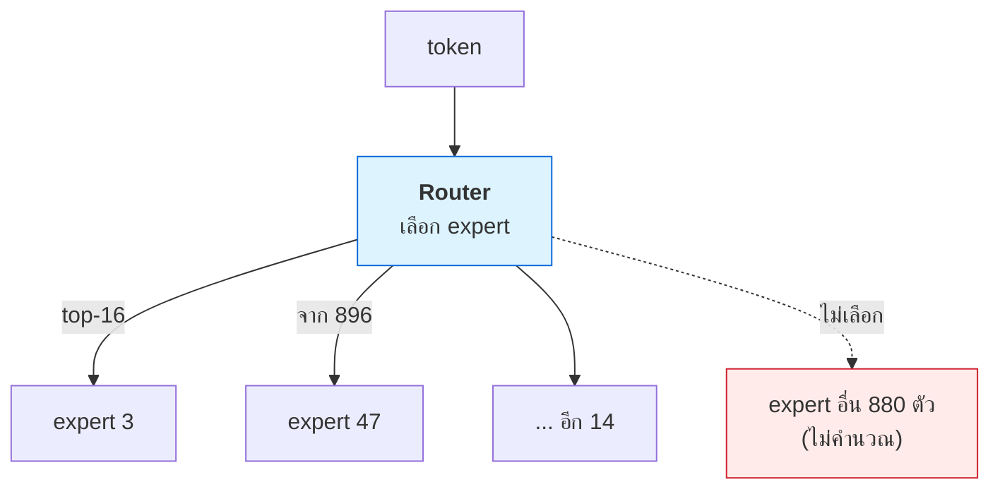

# บทที่ 78 · สถาปัตยกรรม LLM ข้างใน — attention, MoE, และเพื่อน

> [บทที่ 47](47-gpu-memory-and-kv-cache.md) ใช้ KV cache โดยไม่ได้อธิบายว่ามันมาจากไหน **บทนี้เปิดฝา
> ดูข้างในว่า attention ทำงานยังไง ทำไม KV cache ถึงมี และทำไม GQA/MLA/MoE
> ถึงเป็นคำที่เจอทุกที่ในวงการ serving**
>
> ตัวเลขคำนวณจาก config จริงด้วย [lab/gpu/attention_kv_demo.py](../lab/gpu/attention_kv_demo.py)

## 78.1 Transformer ในสามประโยค {#s78-1}

```
1. token → embedding (เวกเตอร์)
2. ผ่าน layer ซ้ำ ๆ แต่ละ layer มี: attention + feed-forward
3. เวกเตอร์สุดท้าย → ทำนาย token ถัดไป
```

**หัวใจคือ attention** — กลไกที่ให้แต่ละ token "มองย้อนไปดู token ก่อนหน้า"
เพื่อตัดสินใจว่าตัวถัดไปควรเป็นอะไร

| ส่วน | ทำอะไร | ศัพท์ที่เจอ |
|---|---|---|
| Attention | token มองกันและกัน | Q, K, V |
| Feed-forward | ประมวลผลต่อทีละ token | MLP, FFN |
| **Residual stream** | ทางด่วนที่ข้อมูลไหลผ่านทุก layer | residual |
| RMSNorm | ปรับสเกลให้เสถียร | normalization |

## 78.2 ทำไมถึงต้องมี KV cache {#s78-2}

attention คำนวณจากสามอย่าง: **Q**uery, **K**ey, **V**alue

```
สร้าง token ที่ 100 → ต้องดู K,V ของ token 1-99 ทั้งหมด
สร้าง token ที่ 101 → ต้องดู K,V ของ token 1-100
                        └── token 1-99 คำนวณ K,V ซ้ำทุกครั้ง = เปลืองมหาศาล
```

**KV cache = เก็บ K,V ที่คำนวณแล้วไว้ ไม่ต้องทำซ้ำ** — นี่คือเหตุผลที่มันมีอยู่
และเป็นตัวกิน VRAM หลักตอน serve ([บทที่ 47.4](47-gpu-memory-and-kv-cache.md#s47-4))

```
KV cache = 2 × layers × kv_heads × head_dim × bytes    (2 = K และ V)
```

**นี่คือจุดที่ทุก optimization ของ attention เล็งไป** — ลด KV cache = รับคนได้มากขึ้น

## 78.3 MHA → GQA → MLA — สงครามลด KV cache {#s78-3}

วัดจริงจาก config Llama-3 8B (32 layers, head_dim 128):

```
แบบ                       kv_heads   bytes/tok    @8k ctx
MHA (kv_heads=32)              32      524288      4096 MB
GQA (kv_heads=8, Llama-3)       8      131072      1024 MB
MLA (latent=512)                -       65536       512 MB
```

| แบบ | ทำอะไร | ผล |
|---|---|---|
| **MHA** (Multi-Head Attention) | ทุก head มี K,V ของตัวเอง | KV cache ใหญ่ |
| **GQA** (Grouped-Query) | หลาย head **แชร์** K,V กัน | **เล็กกว่า 4 เท่า** |
| **MLA** (Multi-head Latent) | บีบ K,V เป็น latent เล็ก ๆ | **เล็กกว่า 8 เท่า** |

> ## นี่คือเหตุผลที่โมเดลใหม่ ๆ ใช้ GQA/MLA หมด
>
> **KV cache เล็กลง 4 เท่า = รับคนพร้อมกันได้ 4 เท่าบนการ์ดใบเดิม** ([บทที่ 47.6](47-gpu-memory-and-kv-cache.md#s47-6))
>
> Llama-3 เปลี่ยนจาก MHA เป็น GQA · DeepSeek ใช้ MLA — ทั้งหมดเพื่อยัดคนได้
> มากขึ้นต่อการ์ด **นี่ไม่ใช่รายละเอียดทางวิชาการ แต่คือสิ่งที่กำหนดต้นทุน
> ต่อ token โดยตรง** ([บทที่ 51.4](51-gpu-observability-and-cost.md#s51-4))

[บทที่ 47.5](47-gpu-memory-and-kv-cache.md#s47-5) พูดถึง GQA แล้วในมุมสูตร — บทนี้แสดงว่าทำไมมันถึงสำคัญ

## 78.4 Linear / recurrent attention — ทำไม context 1M ถึงเป็นไปได้ {#s78-4}

**ปัญหาของ attention ปกติ: KV cache โตตาม context** — ยิ่ง context ยาว
ยิ่งกิน VRAM ไม่มีเพดาน context 1M token แทบเป็นไปไม่ได้ด้วย attention ปกติ

```
Attention ปกติ : จำ K,V ของทุก token → state โตเรื่อย ๆ (O(n))
Linear/recurrent: ยุบอดีตเป็น state ขนาดคงที่ → state ไม่โต (O(1))
```

| แบบ | state | context ยาว |
|---|---|---|
| **Full attention** | โตตาม token | แม่นแต่แพง |
| **Linear** (DeltaNet, GDN) | คงที่ | เร็ว/ประหยัดแต่จำได้จำกัด |
| **Mamba** (SSM) | คงที่ | เหมือนกัน |
| **Hybrid** | สลับ full กับ linear เป็นช่วง ๆ | ได้ทั้งสองอย่าง |

> ## กุญแจ: state ขนาดคงที่ = context ยาวไม่กิน VRAM เพิ่ม
>
> **linear attention ยุบอดีตทั้งหมดเป็น state ก้อนเดียวที่ไม่โต** — จึงรับ
> context 1M token ได้โดย VRAM ไม่ระเบิด แลกกับการที่ "จำ" รายละเอียดเก่าได้
> หยาบกว่า full attention
>
> **hybrid stack** (สลับ full ทุก ๆ N layer) คือทางสายกลางที่โมเดลใหม่ ๆ ใช้ —
> ได้ context ยาวจาก linear + ความแม่นจาก full เป็นจุด ๆ

## 78.5 MoE — โมเดลใหญ่ที่คำนวณเท่าโมเดลเล็ก {#s78-5}

**Mixture of Experts: มี "ผู้เชี่ยวชาญ" หลายตัว แต่แต่ละ token ใช้แค่ไม่กี่ตัว**

วัดจริง (ตัวอย่าง 16-of-896):

```
16-of-896: active แค่ 1.8% ของ expert
→ คำนวณเท่า dense 16 expert แต่มีความรู้ของ 896 expert
```



| คำ | คือ |
|---|---|
| **Router** | ตัวเลือกว่า token นี้ส่งไป expert ไหน |
| **Sparsity** | active แค่ส่วนน้อย (16 จาก 896 = 1.8%) |
| **Load balancing** | เกลี่ยไม่ให้ expert บางตัวโหลดหนักไป |

> ## MoE เปลี่ยนสมการ VRAM vs compute
>
> **น้ำหนักทั้งหมดต้องโหลดใน VRAM (896 expert)** แต่ **คำนวณแค่ 16 ตัว** —
> ดังนั้น MoE กิน **VRAM เยอะ แต่ compute น้อย** ต่างจาก dense model
>
> นี่กระทบการวางแผน serve โดยตรง: โมเดล MoE อาจโหลดไม่ลงการ์ดใบเดียวทั้งที่
> "active param" น้อย ต้องกระจายด้วย **expert parallelism** ([บทที่ 50](50-multi-gpu-and-networking.md))

## 78.6 ศัพท์ที่เหลือที่จะเจอ {#s78-6}

รู้ไว้พออ่านบล็อก/paper รู้เรื่อง

| คำ | คือ (สั้นที่สุด) |
|---|---|
| **Residual stream** | ทางด่วนที่เวกเตอร์ไหลผ่านทุก layer แต่ละ layer บวกเพิ่มเข้าไป |
| **RMSNorm** | ปรับสเกลเวกเตอร์ให้เสถียร (เบากว่า LayerNorm) |
| **Softmax** | แปลงคะแนนเป็นความน่าจะเป็น (รวมได้ 1) |
| **Prefill** | ประมวลผล prompt ทั้งก้อนทีเดียว (compute-bound) |
| **Decode** | สร้างทีละ token (memory-bound) ([บทที่ 48](48-serving-llm.md)) |
| **Head dim** | ขนาดเวกเตอร์ต่อ attention head |

> **prefill vs decode คือความต่างที่สำคัญที่สุดตอน serve** ([บทที่ 48](48-serving-llm.md)) —
> prefill คำนวณหนักครั้งเดียว, decode สร้างทีละ token ช้า ๆ และติด memory
> bandwidth นี่คือที่มาของ TTFT (prefill) vs TPOT (decode)

## 78.7 ทำไมต้องรู้เรื่องนี้ถ้าทำ serving {#s78-7}

การเลือกโมเดลและตั้งค่า serve ขึ้นกับ architecture ทั้งนั้น

| ตัดสินใจ | ต้องรู้ architecture |
|---|---|
| รับคนได้กี่คนต่อการ์ด | KV cache = attention แบบไหน ([78.3](#s78-3)) |
| context ยาวได้แค่ไหน | full หรือ linear attention ([78.4](#s78-4)) |
| โมเดลโหลดลงการ์ดไหม | MoE กิน VRAM ตาม total param ([78.5](#s78-5)) |
| ต้องกระจายหลายการ์ดไหม | expert/tensor parallel ([บทที่ 50](50-multi-gpu-and-networking.md)) |

**อ่านบล็อก serving หรือ model card แล้วเห็นคำว่า GQA/MLA/MoE ต้องแปลเป็น
"กระทบ VRAM/ความจุยังไง" ได้ทันที** — นั่นคือความต่างระหว่างคนที่ตั้งค่า serve
เป็นกับคนที่กดตามคู่มือ

## แบบฝึกหัด

1. รัน [lab/gpu/attention_kv_demo.py](../lab/gpu/attention_kv_demo.py) — GQA เล็กกว่า MHA กี่เท่า
2. เปิด config (config.json) ของโมเดลที่คุณใช้ — `num_key_value_heads` เท่าไร
   เป็น MHA หรือ GQA
3. คำนวณ KV cache ของ Qwen 7B ที่ context 32k — ใช้ [vram_calc.py](../lab/gpu/vram_calc.py)
4. หาโมเดล MoE (เช่น Mixtral) — total param กับ active param ต่างกันเท่าไร
   โหลดลง RTX PRO 6000 ไหม ([78.5](#s78-5))
5. ตอบตัวเอง: ทำไม context 1M ถึงต้องใช้ linear/hybrid attention ([78.4](#s78-4))
6. อ่าน model card ของโมเดลใหม่สักตัว แล้วหาว่าใช้ attention แบบไหน — แปลว่า
   VRAM ต่อ token เท่าไร
7. อธิบายให้เพื่อนฟังว่าทำไม MoE ถึง "ใหญ่แต่เร็ว" ([78.5](#s78-5))

***
[⬅ VRAM และ KV cache](47-gpu-memory-and-kv-cache.md) · [สารบัญ](../README.md) · [vLLM ข้างใน — PagedAttention และ prefix cache ➡](79-vllm-internals.md)
