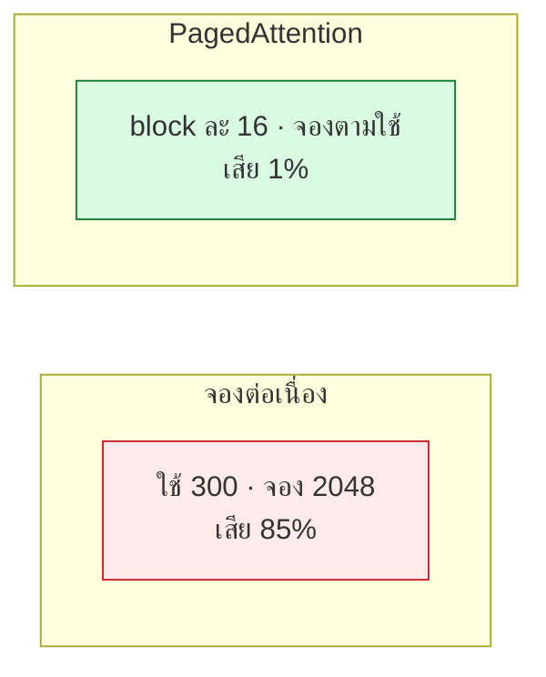

# บทที่ 79 · vLLM ข้างใน — PagedAttention, prefix cache, และ scheduler

> [บทที่ 48](48-serving-llm.md) ใช้ vLLM โดยถือว่ามันเก่ง **บทนี้เปิดฝาดูว่าทำไมมันเร็ว** —
> PagedAttention จัดการ KV cache ยังไง, prefix caching ประหยัดอะไร, scheduler
> ตัดสินใจยังไง
>
> ตัวเลขคำนวณจริงด้วย [lab/gpu/prefix_cache_demo.py](../lab/gpu/prefix_cache_demo.py)

## 79.1 ปัญหาที่ vLLM แก้ — KV cache จัดการยาก {#s79-1}

[บทที่ 78.2](78-llm-architecture-internals.md#s78-2) บอกว่า KV cache กิน VRAM หลัก **แต่ปัญหาไม่ใช่แค่ขนาด —
มันคือการจัดการพื้นที่**

```
ปัญหา: ไม่รู้ล่วงหน้าว่า request จะยาวกี่ token
   → จองเผื่อ max_len ทุก request → เสียพื้นที่มหาศาล
```

**นี่คือปัญหาเดียวกับการจัดการหน่วยความจำของ OS** — และ vLLM แก้ด้วยวิธี
เดียวกับที่ OS ใช้: **paging** ([บทที่ 35](35-linux-internals.md))

## 79.2 PagedAttention — virtual memory สำหรับ KV cache {#s79-2}

**แทนที่จะจอง KV cache ก้อนต่อเนื่อง จองเป็น block เล็ก ๆ ตามใช้จริง**

วัดจริง — request ที่ตั้ง max 2048 แต่ใช้จริง 300 token:

```
จองแบบ contiguous (max 2048): ใช้จริง 300 → เสีย 85%
PagedAttention (block 16):     จอง 19 block = 304 tok → เสีย 1%
```

**จาก 85% เหลือ 1%** — นี่คือเหตุผลที่ vLLM รับคนได้มากกว่า framework เก่าหลายเท่า
บนการ์ดใบเดียวกัน



| คำ | คือ |
|---|---|
| **Block** | หน่วยเล็กสุดของ KV cache (เช่น 16 token) |
| **Block table** | แผนที่ว่า request ไหนใช้ block ไหน (เหมือน page table ของ OS) |
| **KV cache manager** | ตัวจัดสรร/คืน block |

> ## PagedAttention = paging ของ OS ยกมาใช้กับ KV cache
>
> block = page · block table = page table · การจองตามใช้จริง = demand paging
> **ถ้าเข้าใจ virtual memory ของ OS ([บทที่ 35](35-linux-internals.md)) ก็เข้าใจ PagedAttention ทันที**
>
> นี่คือตัวอย่างที่สวยที่สุดของ "แนวคิดจากที่หนึ่งใช้แก้ปัญหาอีกที่" — คนที่
> ออกแบบ vLLM เห็นว่าปัญหา KV cache คือปัญหา memory management ที่ OS แก้มา
> 50 ปีแล้ว

## 79.3 Prefix caching — ไม่ prefill ซ้ำ {#s79-3}

**chat ส่ง history ทั้งหมดกลับมาทุก turn** — ถ้า prefill ใหม่ทุกครั้งเปลืองมหาศาล

```
turn 1: [system] [user1]                    → prefill ทั้งหมด
turn 2: [system] [user1] [asst1] [user2]    → system+user1 เคยทำแล้ว!
turn 3: [system] [user1] [asst1] [user2] [asst2] [user3]  → ซ้ำอีก
```

**prefix caching เก็บ KV ของส่วนที่ซ้ำไว้ ไม่ต้อง prefill ใหม่**

วัดจริง (system prompt 500 token + chat หลาย turn):

```
  turn     ไม่มี cache      มี cache   ประหยัด
     5          3500 tok       500 tok      86%
    10          9500 tok      1000 tok      89%
    20         29000 tok      2000 tok      93%
```

**chat ยิ่งยาว ยิ่งประหยัด — 20 turn ประหยัด prefill 93%** เพราะ system prompt +
history ที่ซ้ำไม่ต้องคำนวณใหม่

> **นี่คือเหตุผลที่ system prompt ยาว ๆ ไม่แพงอย่างที่คิด** — prefill ครั้งเดียว
> แล้ว cache ไว้ ทุก turn ถัดไปใช้ซ้ำ (ถ้า serve บนเครื่องเดิม — [บทที่ 57.4](57-scaling-out.md#s57-4)
> session affinity)

## 79.4 เคสยาก — hybrid model กับ prefix cache {#s79-4}

**prefix caching ตรงไปตรงมากับ attention ปกติ แต่ยากกับ hybrid** ([บทที่ 78.4](78-llm-architecture-internals.md#s78-4))

```
Full attention layer  : KV cache เป็น block → cache/restore ง่าย
Linear/recurrent layer: state ก้อนเดียวที่ยุบอดีต → snapshot ยังไง?
```

| ชั้น | เก็บ prefix ยังไง |
|---|---|
| Full attention | เก็บ paged KV block (ปกติ) |
| **Recurrent/linear** | ต้อง **snapshot recurrent state** ณ จุดที่ cache |

> **นี่คือโจทย์วิจัยจริงในวงการ serving ตอนนี้** — hybrid model ต้อง cache
> ทั้ง paged KV (ของ full layer) **และ** snapshot ของ recurrent state (ของ
> linear layer) พร้อมกัน ให้ตรงจุดเดียวกัน ซับซ้อนกว่า cache แบบ paged อย่างเดียว
> มาก

## 79.5 Cache retention — เก็บอันไหน ทิ้งอันไหน {#s79-5}

VRAM มีจำกัด — cache เต็มต้องทิ้งบางอัน **นโยบายการทิ้งสำคัญ**

| นโยบาย | ทำอะไร |
|---|---|
| **LRU** | ทิ้งอันที่ไม่ถูกใช้นานสุด |
| **Interval-based** | เก็บตามช่วงเวลา |
| **"cache on second hit"** (Marconi-style) | เก็บเฉพาะ prefix ที่ถูกใช้ซ้ำ ไม่เก็บทุกอัน |

> **"cache on second hit" ฉลาดตรงที่ไม่เปลือง cache กับ prefix ที่ใช้ครั้งเดียว** —
> เก็บเฉพาะที่พิสูจน์แล้วว่าถูกใช้ซ้ำ หลักการเดียวกับ tail sampling ใน
> observability ([บทที่ 68.8](68-observability-deep.md#s68-8)) — เก็บเฉพาะที่มีค่า

**KV offloading หลาย tier** — เมื่อ VRAM เต็ม ย้าย KV cache ไป CPU RAM หรือ
disk แทนการทิ้ง:

```
VRAM (เร็วสุด แพงสุด) → CPU RAM → disk (ช้าสุด ถูกสุด)
```

เหมือน memory hierarchy ปกติ — trade ความเร็วกับความจุ

## 79.6 Scheduler — ตัดสินใจว่าใครได้รันเมื่อไร {#s79-6}

vLLM รับหลาย request พร้อมกัน (continuous batching — [บทที่ 48](48-serving-llm.md)) **scheduler
คือตัวตัดสินว่าแต่ละ step เอา request ไหนเข้า batch**

```
ทุก step: มี request ใหม่เข้าคิว · request เก่ากำลัง decode
scheduler ตัดสิน: รับใหม่เข้า batch? · หรือให้ decode ตัวเก่าก่อน?
   ต้องดู: VRAM เหลือพอไหม · ใครรอนานแล้ว · prefill vs decode
```

| ต้องบาลานซ์ | เพราะ |
|---|---|
| prefill (คนใหม่) กับ decode (คนเก่า) | prefill หนัก · decode เบาแต่ต้องต่อเนื่อง |
| รับเพิ่ม vs VRAM เต็ม | รับเกิน → OOM → ล่มทั้ง batch |
| คนรอนาน vs throughput | ยุติธรรม vs เร็วรวม |

> **scheduler คือหัวใจที่ทำให้ TTFT กับ throughput ขัดกัน** — รับคนใหม่เร็ว
> (TTFT ดี) แต่ prefill แย่ง compute จาก decode (TPOT แย่) การจูนตรงนี้คือ
> ศิลปะของการ serve ([บทที่ 48](48-serving-llm.md), [51.3](51-gpu-observability-and-cost.md#s51-3))

## 79.7 อ่าน source ของ vLLM {#s79-7}

vLLM เป็น open source — และวงการ serving เคลื่อนเร็วมาก **การอ่าน PR/RFC
บน GitHub เป็นทักษะจริง**

```
github.com/vllm-project/vllm
  vllm/core/scheduler.py          ← scheduler logic
  vllm/core/block_manager.py      ← KV cache / block table
  vllm/attention/                 ← attention backends
```

| อ่านอะไร | เจออะไร |
|---|---|
| **PR ที่เพิ่ง merge** | feature/optimization ล่าสุด |
| **RFC** | design ที่กำลังถกกัน |
| **issue** | bug/limitation ที่รู้กันอยู่ |

> **การอ่านโค้ด serving engine เป็นได้ ต่อยอดจาก[บทที่ 63](63-reverse-engineering.md) (อ่านสิ่งที่
> ไม่มีเอกสาร) และ[บทที่ 30](30-git.md) (อ่าน history/PR)** — ทักษะการอ่านโค้ดคนอื่น
> สำคัญกว่าการเขียนเองในงานที่ต่อยอดจาก open source

## แบบฝึกหัด

1. รัน [lab/gpu/prefix_cache_demo.py](../lab/gpu/prefix_cache_demo.py) — chat 20 turn ประหยัด prefill กี่ %
2. คำนวณ: PagedAttention block 16 กับ request 100 token — เสียพื้นที่กี่ %
3. ติดตั้ง vLLM แล้วเปิด `--enable-prefix-caching` — วัด TTFT ของ turn ที่ 2
   เทียบ turn แรก
4. เปิด `vllm/core/scheduler.py` บน GitHub — อ่านว่ามันตัดสินใจ prefill vs
   decode ยังไง
5. ตอบตัวเอง: ทำไม PagedAttention ถึงเทียบได้กับ virtual memory ของ OS ([79.2](#s79-2))
6. หา PR ล่าสุดใน vllm-project/vllm ที่เกี่ยวกับ prefix cache — มันแก้อะไร
7. อธิบายให้เพื่อนฟังว่าทำไม system prompt ยาวไม่แพงถ้ามี prefix cache ([79.3](#s79-3))

***
[⬅ สถาปัตยกรรม LLM ข้างใน](78-llm-architecture-internals.md) · [สารบัญ](../README.md) · [Serving LLM ให้เป็น API ➡](48-serving-llm.md)
