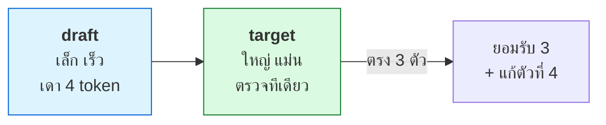

# บทที่ 80 · Speculative Decoding — เร่ง decode ด้วยการเดา

> [บทที่ 48](48-serving-llm.md) บอกว่า decode ช้าเพราะทำทีละ token และติด memory bandwidth
> **บทนี้คือทางเร่งที่ไม่ต้องเปลี่ยนโมเดล: ให้โมเดลเล็กเดาล่วงหน้า
> แล้วโมเดลใหญ่ตรวจทีเดียวหลาย token**
>
> ตัวเลข speedup คำนวณจริงด้วย [lab/gpu/spec_decode_demo.py](../lab/gpu/spec_decode_demo.py)

## 80.1 ปัญหา — decode ทำทีละ token ช้า {#s80-1}

```
decode ปกติ: สร้าง token 1 → 2 → 3 → 4 ... ทีละตัว
             แต่ละตัวต้องอ่านน้ำหนักทั้งโมเดลจาก VRAM (memory-bound)
```

**GPU ว่าง compute แต่รอ memory** ([บทที่ 48](48-serving-llm.md)) — สร้าง 1 token ใช้ compute
นิดเดียวแต่ต้องโหลดน้ำหนักทั้งก้อน ถ้าสร้างหลาย token พร้อมกันได้จะคุ้มกว่ามาก

## 80.2 ไอเดีย — เดาก่อน ตรวจทีหลัง {#s80-2}

```
1. draft model (เล็ก เร็ว) เดา k token ล่วงหน้า:  "the cat sat on"
2. target model (ใหญ่ แม่น) ตรวจทั้ง k token ทีเดียว (1 forward)
3. ยอมรับ token ที่ตรง · ตัดตั้งแต่ตัวแรกที่ผิด
```



**กุญแจ: target ตรวจ k token ใน 1 forward** — แทนที่จะ forward k ครั้ง
ทำครั้งเดียว แล้วได้หลาย token ถ้า draft เดาถูก

> **ผลลัพธ์เหมือนกับ target รันเดี่ยวเป๊ะ** — spec decode ไม่ลดคุณภาพ เพราะ
> target เป็นคนตรวจทุก token สุดท้าย draft แค่ช่วยเดา ผิดก็ถูกตัดทิ้ง

## 80.3 speedup ขึ้นกับ acceptance rate {#s80-3}

**acceptance rate = draft เดาถูกกี่ %** — ยิ่งสูง ยิ่งเร็ว

วัดจริง (draft เดา 4 token/รอบ, draft ถูกกว่า target 5 เท่า):

```
  acceptance     ได้/รอบ   speedup
        50%       1.94       1.08x
        70%       2.77       1.54x
        80%       3.36       1.87x
        90%       4.10       2.28x
```

| ตัวชี้ | คือ |
|---|---|
| **Acceptance rate** | draft เดาถูกกี่ % ต่อ token |
| **Accepted tokens per step** | ได้กี่ token ต่อ 1 forward ของ target |
| **Speedup** | เร็วขึ้นกี่เท่าเทียบ decode ปกติ |

> ## acceptance ต่ำไป = ช้ากว่าเดิม
>
> ถ้า draft เดาผิดบ่อย (acceptance 50%) speedup แค่ 1.08x — เกือบไม่คุ้ม
> เพราะเสียเวลารัน draft ไปเปล่า ๆ **draft ต้องเก่งพอ** ถึงจะคุ้ม
>
> นี่คือเหตุผลที่ต้องวัด acceptance จริงก่อนเปิดใช้ ไม่ใช่เปิดแล้วหวังว่าเร็วขึ้น

## 80.4 ทำไม coding เร่งได้ดีกว่า creative writing {#s80-4}

**acceptance ขึ้นกับว่า token ถัดไปเดาง่ายแค่ไหน**

```
coding    : syntax, boilerplate, indentation เดาง่าย → acceptance สูง
creative  : คำถัดไปหลากหลาย ไม่มีรูปแบบตายตัว     → acceptance ต่ำ
```

วัดจากตัวเลขข้างบน:

```
coding (acceptance 0.9) เร็วกว่า creative (acceptance 0.5) = 2.1 เท่า
```

> **อ่านกราฟ acceptance rate แล้วบอกได้ว่างานแบบไหนคุ้มเปิด spec decode** —
> งาน code completion / structured output เร่งได้เยอะ ส่วนงานเขียนสร้างสรรค์
> อาจไม่คุ้ม นี่คือสิ่งที่คนตั้งค่า serve เป็นต้องรู้

## 80.5 draft มาจากไหน — วิธีต่าง ๆ {#s80-5}

| วิธี | draft มาจาก | จุดเด่น |
|---|---|---|
| **Draft model** | โมเดลเล็กแยกต่างหาก | ตรงไปตรงมา · ต้องหาโมเดลคู่ |
| **MTP** (Multi-Token Prediction) | โมเดลเดาหลาย token ในตัวเอง | ไม่ต้องมีโมเดลแยก |
| **EAGLE** | เดาจาก feature ของ target | acceptance สูง |
| **Block-diffusion** (DSpark) | เดาเป็นบล็อกแบบ diffusion | แนวใหม่ |

> **ทั้งหมดต่างกันที่ "draft มาจากไหน" แต่หลักการเดียวกัน** — เดาแล้วให้ target
> ตรวจ EAGLE/MTP ได้ acceptance สูงกว่าเพราะ draft ใกล้ target มากกว่าการใช้
> โมเดลเล็กแยก

## 80.6 เมื่อไรควรใช้ {#s80-6}

| เหมาะ | ไม่เหมาะ |
|---|---|
| งานที่ acceptance สูง (code, structured) | creative writing (acceptance ต่ำ) |
| latency สำคัญ (ต้องการ token เร็ว) | throughput สำคัญ + batch ใหญ่แล้ว |
| มี draft ที่ดี | ไม่มีโมเดลคู่ที่เข้ากัน |

> ## ⚠️ spec decode กับ batch ใหญ่อาจไม่คุ้ม
>
> ตอน batch ใหญ่ GPU มีงาน compute เต็มมืออยู่แล้ว (ไม่ได้ว่าง memory-bound)
> — spec decode ที่แลก compute เพิ่มเพื่อลด memory access อาจไม่ช่วย
>
> **spec decode ช่วยมากตอน batch เล็ก/latency-sensitive** ซึ่งเป็นตอนที่ GPU
> ว่าง compute แต่รอ memory ([บทที่ 48](48-serving-llm.md)) — เข้าใจว่างานคุณ compute-bound
> หรือ memory-bound ก่อนเปิด

## แบบฝึกหัด

1. รัน [lab/gpu/spec_decode_demo.py](../lab/gpu/spec_decode_demo.py) — acceptance 90% เร่งได้กี่เท่า
2. แก้ `draft_ratio` ในสูตร (draft แพงขึ้น) — speedup เปลี่ยนยังไง
3. คำนวณ: ถ้า draft เดา 8 token แทน 4 (k=8) ที่ acceptance 0.8 — เร็วขึ้นไหม
4. ตอบตัวเอง: งานของคุณ acceptance น่าจะสูงหรือต่ำ ([80.4](#s80-4)) — คุ้มเปิดไหม
5. ลอง vLLM ด้วย `--speculative-model` แล้ววัด TPOT เทียบไม่เปิด
6. อ่านกราฟ acceptance rate จากบล็อก serving สักอัน — งานแบบไหน acceptance สูง
7. อธิบายให้เพื่อนฟังว่าทำไม spec decode ไม่ลดคุณภาพ output ([80.2](#s80-2))

***
[⬅ Serving LLM ให้เป็น API](48-serving-llm.md) · [สารบัญ](../README.md) · [Serving features — chat template, tool calling ➡](81-serving-features.md)
