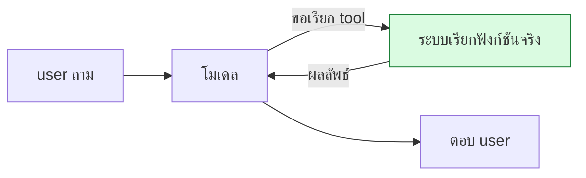

# บทที่ 81 · ฟีเจอร์ฝั่ง serving — chat template, tool calling, structured output

> [บทที่ 48](48-serving-llm.md) serve โมเดลให้ตอบข้อความ **บทนี้คือชั้นที่ทำให้ LLM ใช้งานจริง
> ในแอป**: แปลง chat เป็นรูปที่โมเดลเข้าใจ, ให้โมเดลเรียกเครื่องมือ, บังคับ
> output ให้ระบบอื่นอ่านต่อได้

## 81.1 Chat template — โมเดลไม่ได้เห็น "messages" {#s81-1}

**API รับ messages เป็น JSON แต่โมเดลเห็นแค่ string เดียว** — chat template
คือตัวแปลง

```python
messages = [
    {"role": "system", "content": "You are helpful."},
    {"role": "user", "content": "Hi"},
]
```

แปลงเป็น (Llama-3 style):

```
<|begin_of_text|><|start_header_id|>system<|end_header_id|>
You are helpful.<|eot_id|><|start_header_id|>user<|end_header_id|>
Hi<|eot_id|><|start_header_id|>assistant<|end_header_id|>
```

| Control token | ทำอะไร |
|---|---|
| `<|begin_of_text|>` | เริ่มข้อความ |
| `<|start_header_id|>` | เริ่มระบุว่าใครพูด (system/user/assistant) |
| `<|eot_id|>` | **จบ turn** — โมเดลหยุดตรงนี้ |

> ## 🔴 chat template ผิด = โมเดลตอบเพี้ยน
>
> **แต่ละโมเดลมี template ของตัวเอง** — ใช้ template ของ Llama กับ Qwen
> โมเดลจะงงและตอบแปลก ๆ นี่คือบั๊กที่พบบ่อยตอน serve โมเดลใหม่
>
> template อยู่ใน `tokenizer_config.json` ของโมเดล — vLLM ใช้ให้อัตโนมัติ
> แต่ถ้าเขียน template เองต้องตรงเป๊ะ **control token ต้องไม่ถูก user ปลอม**
> (ต่อยอด prompt injection [บทที่ 52.3](52-ai-system-security.md#s52-3) — ถ้า user พิมพ์ `<|eot_id|>`
> ได้ ต้อง escape)

## 81.2 Tool calling — ให้โมเดลเรียกเครื่องมือ {#s81-2}

**LLM ทำเลขไม่แม่น เข้าถึงข้อมูลสดไม่ได้ — tool calling แก้โดยให้มันขอเรียก
ฟังก์ชัน**

```
user: "อากาศกรุงเทพวันนี้"
   ↓
โมเดลตอบว่า: เรียก get_weather(city="Bangkok")   ← ไม่ได้ตอบเอง
   ↓
ระบบเรียกฟังก์ชันจริง → ได้ 32°C → ป้อนกลับเข้าโมเดล
   ↓
โมเดลตอบ: "กรุงเทพวันนี้ 32°C"
```



> ## 🔴 tool call ต้องตรวจสิทธิ์ฝั่ง server เสมอ
>
> โมเดลบอกว่า "เรียก delete_user(id=5)" **ไม่ได้แปลว่าต้องทำตาม** — ตรวจสิทธิ์
> ก่อนทุกครั้ง ([บทที่ 52.3](52-ai-system-security.md#s52-3)) เพราะ user อาจ prompt-inject ให้โมเดล
> ขอเรียก tool ที่ไม่ควร
>
> **โมเดลเสนอ · server ตัดสินใจ** — ไม่ใช่โมเดลสั่ง server ทำ

## 81.3 Structured output — บังคับ output ให้ parse ได้ {#s81-3}

**ปัญหา: ขอ JSON แต่โมเดลตอบ "ขอโทษครับ นี่คือ JSON: {...}"** — parse ไม่ได้

**structured output บังคับให้ทุก token ที่ decode ตรงตาม schema**

```python
schema = {"type": "object",
          "properties": {"name": {"type": "string"}, "age": {"type": "integer"}},
          "required": ["name", "age"]}
```

```
→ grammar (XGrammar) บังคับ decode ให้ตรง schema ทุก token
→ output รับประกันว่า json.loads() ผ่านเสมอ
```

**กลไก: ตอน decode แต่ละ token กรองเฉพาะ token ที่ยังทำให้ output ถูก grammar**
— โมเดลไม่มีทางออกนอกรูปแบบได้เลย

| ต้องการ | ใช้ |
|---|---|
| JSON ตาม schema | JSON schema + XGrammar/Outlines |
| เลือกจาก choices | regex / enum |
| รูปแบบเฉพาะ | context-free grammar |

> **นี่คือความต่างระหว่าง "หวังว่าโมเดลจะตอบ JSON" กับ "รับประกันว่าเป็น JSON"** —
> ระบบ production ที่เอา output ไป parse ต่อต้องใช้ structured output ไม่งั้น
> จะเจอ parse error สุ่ม ๆ ที่ reproduce ยาก

## 81.4 Reasoning parser — แยกความคิดออกจากคำตอบ {#s81-4}

โมเดล reasoning (เช่น o1-style) คิดใน `<think>...</think>` ก่อนตอบ

```
<think>
ผู้ใช้ถามเลข ต้องคำนวณ 15 × 23 = 345
</think>
คำตอบคือ 345
```

**reasoning parser แยกส่วน think ออกจากคำตอบจริง** — เพื่อไม่แสดง reasoning
ให้ user (หรือแสดงแยกส่วน) และนับ token reasoning ต่างหาก ([บทที่ 52.6](52-ai-system-security.md#s52-6) เรื่อง cost)

## 81.5 Multimodal — เพิ่มภาพเข้า context {#s81-5}

โมเดล vision รับภาพ + ข้อความ

```
[ภาพ] + "อธิบายภาพนี้"
   ↓
vision encoder แปลงภาพเป็น token (เหมือนข้อความ)
   ↓
โมเดลประมวลผลรวมกับ text token
```

> **vision encoder มี parallelism ของตัวเอง** — ภาพความละเอียดสูงกลายเป็น
> token จำนวนมาก ทำให้ context ยาวขึ้นเร็ว และ encoder ส่วนนี้อาจต้อง scale
> ต่างจากส่วน text ([บทที่ 50](50-multi-gpu-and-networking.md))

## 81.6 ทั้งหมดนี้อยู่ตรงไหนในระบบ {#s81-6}

ต่อจาก architecture ของ[บทที่ 77](77-system-design.md) — ฟีเจอร์เหล่านี้อยู่ที่ชั้น serving

```
API (chat template) → vLLM (structured output constraint) → GPU
       ↓ tool call
   ระบบเรียกฟังก์ชัน (ตรวจสิทธิ์ที่นี่)
```

| ฟีเจอร์ | ระวังอะไร |
|---|---|
| chat template | ต้องตรงกับโมเดล · escape control token ([81.1](#s81-1)) |
| tool calling | ตรวจสิทธิ์ฝั่ง server ([81.2](#s81-2)) |
| structured output | ใช้เมื่อต้อง parse ต่อ ([81.3](#s81-3)) |
| reasoning | นับ token แยก · ไม่ leak ([81.4](#s81-4)) |
| multimodal | context ยาวขึ้นเร็ว ([81.5](#s81-5)) |

## แบบฝึกหัด

1. เปิด `tokenizer_config.json` ของโมเดลที่ใช้ — หา `chat_template`
2. แปลง messages เป็น string ด้วย template นั้น — control token หน้าตายังไง
3. ลอง vLLM ด้วย `guided_json` (structured output) — output parse ได้ทุกครั้งไหม
4. ตอบตัวเอง: ถ้า user พิมพ์ `<|eot_id|>` ในข้อความ จะเกิดอะไร ([81.1](#s81-1))
5. ออกแบบ tool calling ที่ปลอดภัย — ตรวจสิทธิ์ตรงไหน ([81.2](#s81-2))
6. เทียบ output ที่ขอ JSON แบบธรรมดา vs structured — อันไหน parse ได้เสมอ
7. อธิบายว่าทำไมใช้ chat template ผิดโมเดลถึงตอบเพี้ยน ([81.1](#s81-1))

***
[⬅ Speculative Decoding](80-speculative-decoding.md) · [สารบัญ](../README.md) · [ประเมินผลโมเดล LLM ➡](82-llm-evaluation.md)
