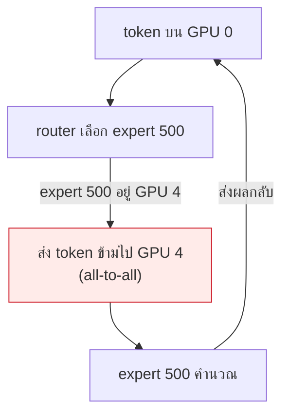
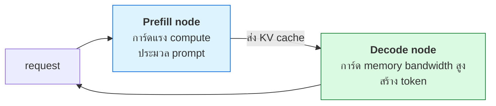
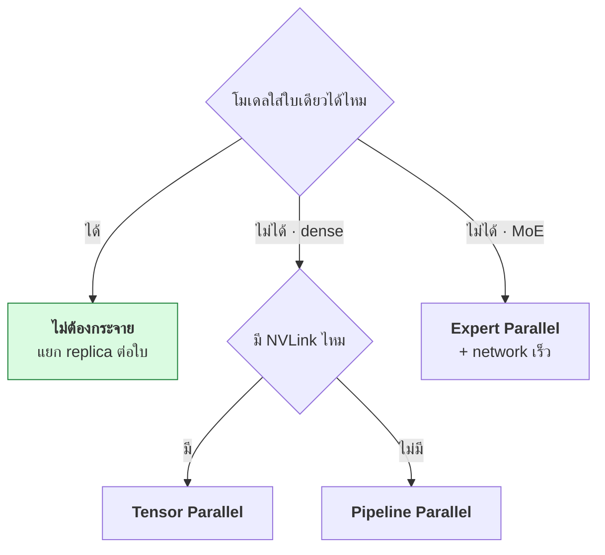

# บทที่ 85 · Parallelism ขั้นสูง — EP, disaggregation, และ collective ops

> [บทที่ 50](50-multi-gpu-and-networking.md) สอน TP/PP/DP และ NCCL **บทนี้ต่อยอดไปที่การกระจายแบบที่
> serving engine สมัยใหม่ใช้จริง**: expert parallelism, การแยก prefill/decode
> คนละเครื่อง, และ collective op ไหนแพงกว่ากัน

## 85.1 ทบทวน — 4 แบบพื้นฐาน {#s85-1}

[บทที่ 50.2](50-multi-gpu-and-networking.md#s50-2) มีแล้ว ทวนสั้น ๆ พร้อมเพิ่มตัวที่ขาด

| แบบ | แบ่งอะไร | คุยกันบ่อยไหม |
|---|---|---|
| **DP** (Data) | แบ่งข้อมูล โมเดลครบทุกใบ | ท้าย step |
| **TP** (Tensor) | ผ่าแบ่งเลเยอร์ | ทุกเลเยอร์ 🔴 |
| **PP** (Pipeline) | แบ่งช่วงเลเยอร์ | จุดต่อ |
| **EP** (Expert) | แบ่ง expert ของ MoE | ทุก MoE layer |
| **SP** (Sequence) | แบ่ง sequence ยาว | attention |

**TEP vs DEP** — Tensor+Expert หรือ Data+Expert parallel รวมกัน ต่างกันที่
expert ถูกแบ่งควบกับ tensor หรือ data — เลือกตามว่าคอขวดอยู่ที่ compute หรือ memory

## 85.2 Expert Parallelism — กระจาย MoE {#s85-2}

[บทที่ 78.5](78-llm-architecture-internals.md#s78-5) บอกว่า MoE โหลด expert ทั้งหมดใน VRAM แต่ใช้ทีละไม่กี่ตัว
— **EP กระจาย expert ไปคนละ GPU**

```
MoE 896 expert · 8 GPU → 112 expert/GPU
token ถูก route ไป expert ที่อาจอยู่คนละ GPU → ต้อง all-to-all
```



> ## นี่คือเหตุผลที่ MoE serve ยากกว่า dense
>
> **token ต้องเดินทางไป expert ที่อาจอยู่คนละการ์ด** แล้วผลกลับมา — ใช้
> **all-to-all** ซึ่งเป็น collective ที่แพงที่สุด ([85.4](#s85-4)) ถ้า network
> ช้า (ไม่มี NVLink/RDMA — [บทที่ 50.6](50-multi-gpu-and-networking.md#s50-6)) EP จะกลายเป็นคอขวดทันที
>
> **load balancing สำคัญมากใน EP** — ถ้า expert บางตัวโดน route หนักกว่า
> GPU นั้นจะกลายเป็นคอขวดขณะที่ GPU อื่นว่าง ([บทที่ 78.5](78-llm-architecture-internals.md#s78-5))

## 85.3 Prefill/Decode disaggregation — แยกคนละเครื่อง {#s85-3}

**prefill กับ decode มีลักษณะ compute ต่างกันสิ้นเชิง** ([บทที่ 48](48-serving-llm.md), [78.6](78-llm-architecture-internals.md#s78-6))

```
prefill : หนัก · parallel ได้ · ประมวล prompt ทั้งก้อนทีเดียว (compute-bound)
decode  : เบา · ทีละ token · memory-bound
```

**ปัญหาเมื่อรวมเครื่องเดียว:**

```
prefill ของคนใหม่แย่ง compute จาก decode ของคนเก่า
→ TTFT ดีขึ้น แต่ TPOT ของคนที่กำลัง decode สะดุด
```

**disaggregation แยกสองงานคนละเครื่อง:**



| | Prefill node | Decode node |
|---|---|---|
| ต้องการ | compute สูง | memory bandwidth สูง |
| งาน | ประมวล prompt | สร้าง token |
| ประโยชน์ | ไม่แย่ง compute กับ decode | TPOT เสถียร |

> ## ราคาที่จ่าย: ต้องส่ง KV cache ข้ามเครื่อง
>
> prefill สร้าง KV cache แล้วต้อง**ส่งให้ decode node** — KV cache ใหญ่
> ([บทที่ 47.4](47-gpu-memory-and-kv-cache.md#s47-4)) การส่งข้ามเครื่องแพง ต้องมี network เร็ว
>
> library อย่าง **NIXL, Mooncake** ทำ KV transfer นี้ให้เร็ว — เป็นหัวใจของ
> การทำ disaggregation ให้คุ้ม ถ้า transfer ช้ากว่าที่ประหยัดได้ ก็ไม่คุ้ม

## 85.4 Collective ops — อันไหนแพงกว่า {#s85-4}

[บทที่ 50.3](50-multi-gpu-and-networking.md#s50-3) มี all-reduce แล้ว — เทียบทั้งชุดว่าอันไหนแพงกว่า

```
all-gather      รวบทุก node ให้เห็นครบ      N ข้อมูล
reduce-scatter  รวม+กระจายชิ้น              N ข้อมูล
all-reduce      รวมทุก node แจกกลับ         2N (= all-gather + reduce-scatter)
all-to-all      ทุก node แลกกับทุก node     แพงสุด · ใช้ใน EP
```

| op | ทำอะไร | ต้นทุน |
|---|---|---|
| **all-gather** | ทุก node เก็บชิ้นจากทุก node มาต่อกัน | N |
| **reduce-scatter** | รวมค่าแล้วแบ่งชิ้นให้แต่ละ node | N |
| **all-reduce** | รวมทุก node แล้วแจกผลกลับ | **2N** |
| **all-to-all** | ทุก node ส่งของต่างกันให้ทุก node | 🔴 **แพงสุด** |

> **all-reduce = all-gather + reduce-scatter** — จึงแพงเป็น 2 เท่า นี่คือ
> op ที่กินเวลาหลักในการเทรน data parallel ([บทที่ 50.3](50-multi-gpu-and-networking.md#s50-3))
>
> **all-to-all แพงที่สุดเพราะทุกคู่ node ต้องแลกข้อมูลกัน** — และเป็น op หลัก
> ของ EP ([85.2](#s85-2)) ทำให้ MoE ไวต่อความเร็ว network มาก

## 85.5 network กำหนดว่าอะไรทำได้ {#s85-5}

[บทที่ 50.4](50-multi-gpu-and-networking.md#s50-4) มีตารางความเร็วแล้ว — เชื่อมกับการเลือก parallelism

| parallelism | ต้องการ network |
|---|---|
| DP | ปานกลาง (sync ท้าย step) |
| **TP** | 🔴 เร็วมาก (ทุกเลเยอร์) — ต้อง NVLink |
| PP | ต่ำ (จุดต่อ) |
| **EP** | เร็ว (all-to-all) — NVLink/RDMA |
| disaggregation | เร็ว (ส่ง KV) — RDMA |

> **นี่คือเหตุผลที่ RTX PRO 6000 ไม่มี NVLink ([บทที่ 50.6](50-multi-gpu-and-networking.md#s50-6)) กระทบการเลือก
> parallelism** — TP/EP ที่ต้องคุยกันถี่จะช้าลงมากบน PCIe ต้องเลี่ยงไป
> pipeline parallel หรือแยก inference เป็นใบ ๆ แทน

## 85.6 เลือกยังไงในทางปฏิบัติ {#s85-6}



| สถานการณ์ | ใช้ |
|---|---|
| โมเดลพอใส่ใบเดียว | **แยก replica** ([บทที่ 57.7](57-scaling-out.md#s57-7)) — ง่ายสุด |
| dense ใหญ่ + NVLink | Tensor Parallel |
| dense ใหญ่ + ไม่มี NVLink | Pipeline Parallel ([บทที่ 50.6](50-multi-gpu-and-networking.md#s50-6)) |
| MoE ใหญ่ | Expert Parallel + RDMA |
| latency สำคัญ + การ์ดเยอะ | disaggregation |

**หลักเดิม: อย่ากระจายถ้าไม่จำเป็น** ([บทที่ 50.1](50-multi-gpu-and-networking.md#s50-1)) — ทุกการกระจายเพิ่ม
communication ที่เป็นคอขวด quantize ([บทที่ 84](84-quantization-and-numerics.md)) ให้พอใส่ใบเดียวก่อน
มักคุ้มกว่ากระจาย

## แบบฝึกหัด

1. รัน [lab/gpu/parallel_demo.py](../lab/gpu/parallel_demo.py) — all-reduce แพงกว่า all-gather กี่เท่า
2. คำนวณ: MoE 256 expert บน 4 GPU — กี่ expert/GPU · ใช้ collective อะไร ([85.2](#s85-2))
3. ตอบตัวเอง: ทำไม disaggregation ถึงช่วย TPOT ([85.3](#s85-3))
4. อ่านเรื่อง Mooncake หรือ NIXL — มันแก้ปัญหา KV transfer ยังไง
5. ตอบตัวเอง: การ์ดคุณมี NVLink ไหม — ควรใช้ TP หรือ PP ([85.5](#s85-5))
6. เทียบ all-to-all กับ all-reduce — ทำไม all-to-all แพงกว่า ([85.4](#s85-4))
7. ออกแบบ: serve MoE 8x7B บนการ์ด 2 ใบไม่มี NVLink — ทำได้ไหม ยังไง ([85.6](#s85-6))

***
[⬅ Quantization และ Numerics](84-quantization-and-numerics.md) · [สารบัญ](../README.md) · [ความปลอดภัยของระบบ AI ➡](52-ai-system-security.md)
